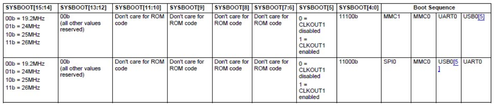
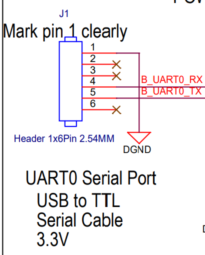
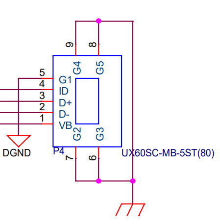
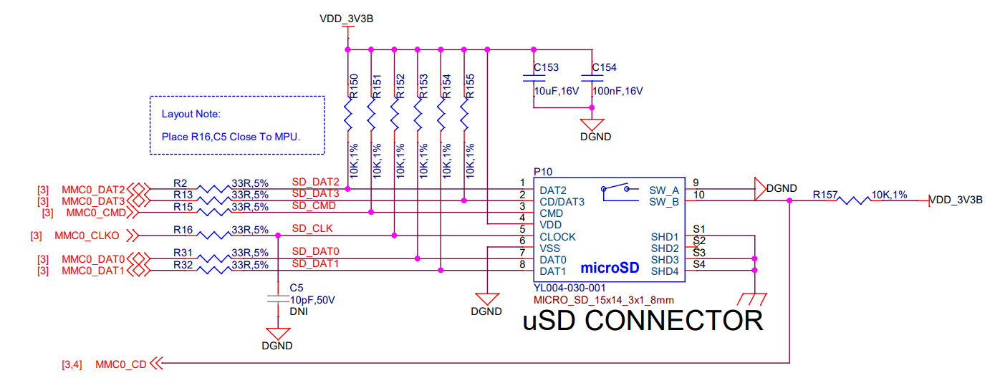
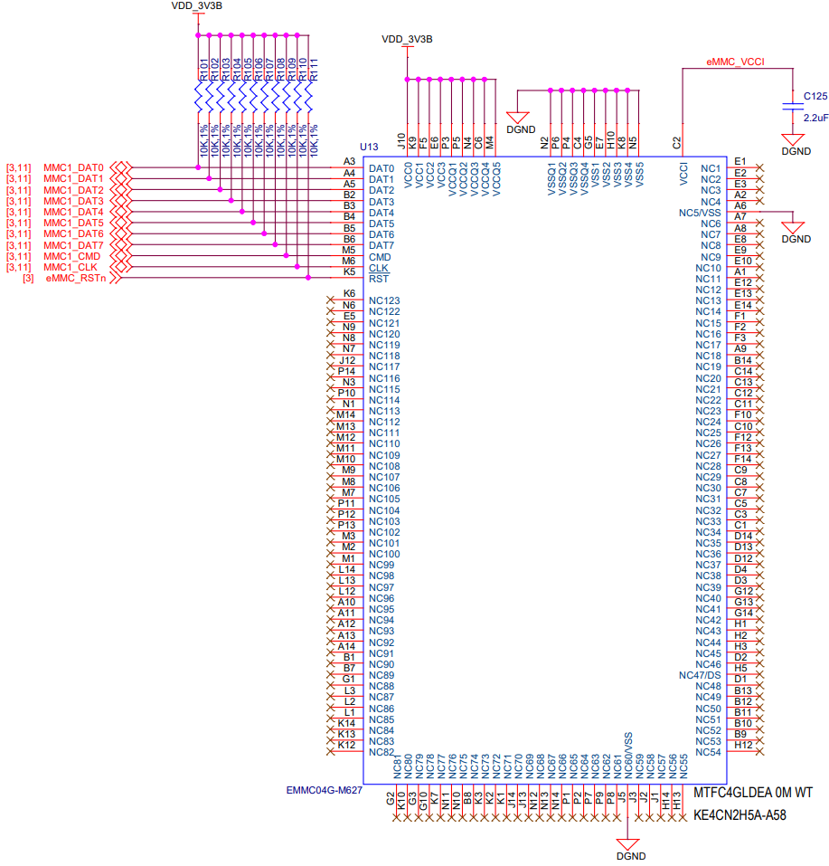

# Beaglebone example

## Cross-toolchain

The most important parameters for the toolchain are:

* CPU architecture: `-mcpu=cortex-a8`.
* Hardware FPU: `-mfpu=neon`.
* NEON floating point ABI: `-mfloat-abi=hard`.
* C-library: `musl`.

Compile it using CrossTool-NG.

## Bootloader

For building U-Boot, there is no need to modify the default configuration file. Just import the defconfig `am335x-boneblack` and build:

```bash
export CROSS_COMPILE=<cross_compilation_toolchain->
make am335x_evm_defconfig
make DEVICE_TREE=am335x-boneblack
```

It produces the SPL (called `MLO` because of a Texas Instrument requirement), and the full U-Boot image `u-boot.img`.

The boot order of the BeagleBone black depends on the BOOT pins. If we go to the schematic of the board:

[schematic][bbb_schematic]


As can be seen from the pull-ups and pull-dows, the boot sequence depends on the state of the S2 button.

When pressed: SPI0 / MMC0 / USB0 / UART0
When not pressed: MMC1 / MMC0 / UART0 / USB0

For reference:
SPI0 is not easily accessible.











### Booting from UART

To boot from UART we need to:

1. Don't have a uSD connected.
2. Don't have an USB0 connected (power the board with a power supply).
3. Connect an USB-to-Serial between the host's PC and the UART0 pins.
4. Press the S2 button.
5. Connect the power supply through the 5mm Jack connector.

If everything worked correctly, you should see that the BeagleBone Black keeps printing the character "C" through the UART:

```bash
sudo picocom -b 115200 /dev/ttyUSB0
[...]
CCCCCCCCCCCCCCCCCCC
```

```bash
sudo chmod 666 /dev/ttyUSB0
snagrecover -s am3358 --uart /dev/ttyUSB0 --baudrate 115200 -f snagboot_am335x.yaml
```

After that, you should have U-boot loaded in the RAM. Doing a power cycle will erase U-Boot from memory.

### Booting from USB

To boot from USB we need to:

1. Don't have a uSD connected.
<!-- 2. Don't have an USB0 connected (power the board with a power supply).
3. Connect an USB-to-Serial between the host's PC and the UART0 pins. -->
1. Press the S2 button.
2. Connect the USB0 for power + signal.

You should see that the USB device was discovered in the kernel messages:

```bash
sudo dmesg | tail -n 10
[ 8779.988628] usb 1-1.2: New USB device found, idVendor=0451, idProduct=6141, bcdDevice= 0.00
[ 8779.988644] usb 1-1.2: New USB device strings: Mfr=33, Product=37, SerialNumber=0
[ 8779.988651] usb 1-1.2: Product: AM335x USB
[ 8779.988657] usb 1-1.2: Manufacturer: Texas Instruments
[ 8780.131264] usbcore: registered new interface driver cdc_ether
[ 8780.183568] rndis_host 1-1.2:1.0 usb0: register 'rndis_host' at usb-0000:c3:00.3-1.2, RNDIS device, 9a:1f:85:1c:3d:0e
[ 8780.183630] usbcore: registered new interface driver rndis_host
```

```bash
snagrecover --am335x-setup > am335x_usb_setup.sh
chmod a+x am335x_usb_setup.sh
sudo ./am335x_usb_setup.sh
```

```bash
snagrecover -s am3358 -f snagboot_am335x.yaml
```

After that, connect to the serial and you should see U-Boot working from RAM.

### Booting from eMMC

### Booting from SD Card

### Linux kernel

make omap2plus_defconfig

[AM335X Sitara datasheet][am335x_sitara_datasheet]
[AM335X Technical Reference Manual][am335x_trm]

[am335x_sitara_datasheet]: https://www.ti.com/document-viewer/AM3358/datasheet
[am335x_trm]: https://www.ti.com/lit/ug/spruh73p/spruh73p.pdf

[bbb_schematic]: https://github.com/beagleboard/beaglebone-black/blob/master/BBB_SCH.pdf
