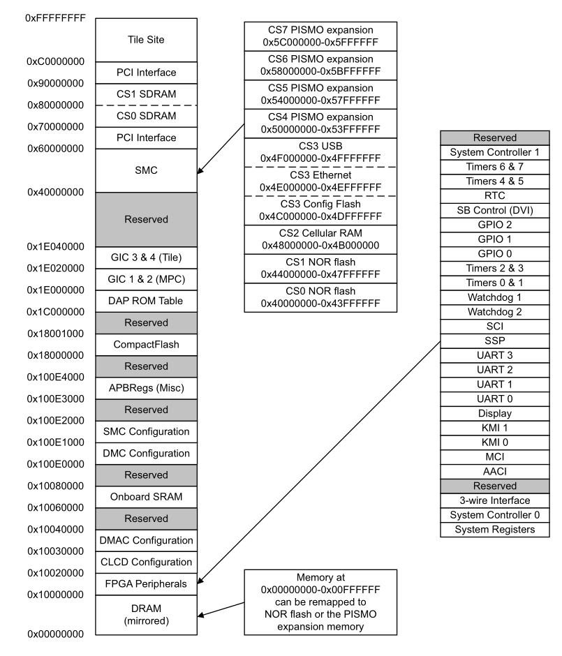

# Cortex A8 bare-metal example

This example runs a QEMU simulation for a [RealView Platform Baseboard for Cortex-A8][realview_docs].

It was built using a custom [Crosstool-NG][crosstool-ng] toolchain with either [Newlib-nano][newlib] or [Picolibc][picolib] C libraries.

For the linker, we place all code in the CS0 SDRAM, starting at address `0x7000_0000`.

The UART0 module corresponds to the [PrimeCell UART (Pl011)][uart_primecell].

## Size comparison

| Lib           | text      | data  | bss   | dec       | hex   |
|:-------------:|:---------:|:-----:|:-----:|:---------:|:-----:|
| Picolibc      | 12972     | 36    | 36884 | 49892     | c2e4  |
| Newlib-nano   | 11288     | 96    | 37192 | 48576     | bdc0  |
| Newlib        | 43730     | 712   | 37180 | 81622     | 13ed6 |

<!-- External links -->
[realview_docs]: https://developer.arm.com/documentation/dui0417/d?lang=en
[uart_primecell]: https://documentation-service.arm.com/static/5e8e36c2fd977155116a90b5
[crosstool-ng]: https://crosstool-ng.github.io/
[newlib]: https://sourceware.org/newlib/
[picolib]: https://github.com/picolibc/picolibc
