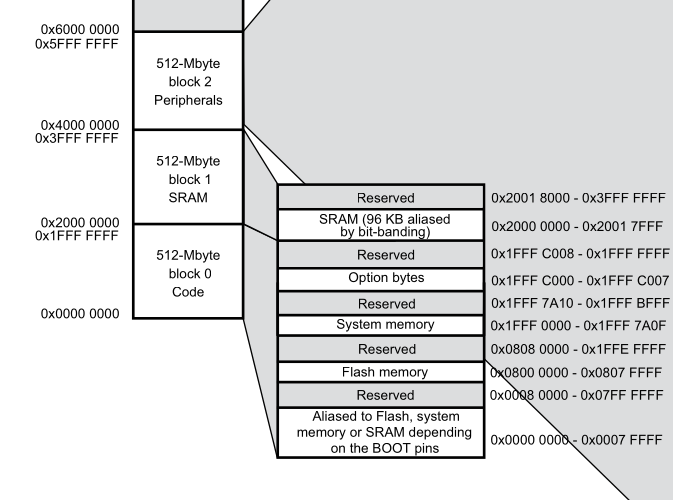
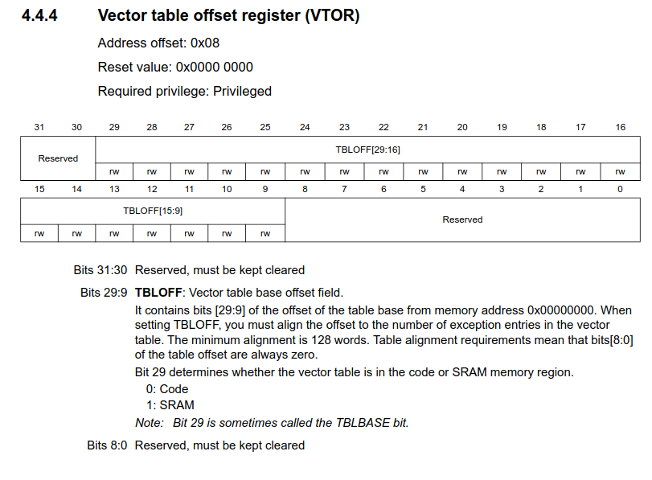

# Cortex-M4 bare-metal example

This example runs a Renode simulation for a [Cortex-M4 STM32F401RE chip][stm32f401re_page].

It was built using a custom [Crosstool-NG][crosstool-ng] toolchain with either [Newlib-nano][newlib] or [Picolibc][picolib] C libraries. Their configuration files can be found inside the `sup` folder.

> [!TIP]
> The C libraries must be build specifically for the `mcpu=cortex-m4` CPU. If you define a multilib toolchain, libraries will be compiled for the ARM instruction set, and will fail to compile for the Thumb instruction set.

This example's [Renode platform][example_platform] was built based on the [Renode's `stm32f4.repl` platform][renode_stm32f4_platform], and the memory addresses were verified against the [SMT32 Cortex-M4 MCUs and MPUs programming manual][stm32_mcu_programming_manual], and the [STM32F401xE reference manual][stm32f401xe_reference_manual].



## The booting address

When originally running this example, on the Renode terminal would appear this message:

```bash
[INFO] cpu: Guessing VectorTableOffset value to be 0x8000000.
```

According to the linker script, we placed our boot code on the Flash Memory at `0x0800_0000`. However, when you look at chapter 4.4 of the [STM32 Cortex-M4 programming manual][stm32_mcu_programming_manual], you will find the register `VTOR` at address `0xE000ED08`, which determines the initial address of the reset vector table.



As we can see, the reset value is `0x0000_0000`, but Renode reads our ELF file, and automatically loads a `0x0800_0000` to match the beginning of our code with the VTOR location. You can check this by printing that memory address in GDB:

```gdb
(gdb) x 0xE000ED08
0xe000ed08:     0x08000000
```

There are two solutions to this problem:

1. Write manually the value of VTOR before starting. This can be done from the `.repl` file like so:

    ```repl
    sysbus:
        init:
            WriteDoubleWord 0xE000ED08 0x08000000  // VTOR
    ```

2. Since the memory region from 0x0000_0000 to 0x0007_FFFF can be aliased to the flash, depending of the electrical value of external boot pins, you can double assign the flash memory to those regions as such:

    ```repl
    flash: Memory.MappedMemory @ {
        sysbus 0x08000000;
        sysbus 0x00000000
    }
        size: 0x200000
    ```

    Once again, we can verify that in fact both addresses contain the same elements by printing its contents in GDB:

    ```gdb
    (gdb) x/4 0x00000000
    0x0:    0x20002b64  0x080000d1  0x080000d5  0x080000d5
    (gdb) x/4 0x08000000
    0x8000000 <_vector_table>:  0x200002b64 0x080000d1  0x080000d5  0x080000d5
    ```

## Size comparison

| Lib           | text      | data  | bss   | Total     |
|:-------------:|:---------:|:-----:|:-----:|:---------:|
| Picolibc      | 8720      | 36    | 12312 | 21068     |
| Newlib-nano   | 6815      | 100   | 12612 | 19527     |
| Newlib        | 8157      | 712   | 12612 | 21481     |

<!-- External links -->
[stm32f401re_page]: https://www.st.com/en/microcontrollers-microprocessors/stm32f401re.html

[stm32_mcu_programming_manual]: https://www.st.com/resource/en/programming_manual/pm0214-stm32-cortexm4-mcus-and-mpus-programming-manual-stmicroelectronics.pdf

[stm32f401xe_reference_manual]: [https://www.st.com/resource/en/reference_manual/rm0368-stm32f401xbc-and-stm32f401xde-advanced-armbased-32bit-mcus-stmicroelectronics.pdf]

[renode_stm32f4_platform]: https://github.com/renode/renode/blob/master/platforms/cpus/stm32f4.repl

[crosstool-ng]: https://crosstool-ng.github.io/
[newlib]: https://sourceware.org/newlib/
[picolib]: https://github.com/picolibc/picolibc

<!--Internal links -->
[example_platform]: https://github.com/ncotti/docs/blob/main/bootloaders/cortex-m4/sup/platform.repl
