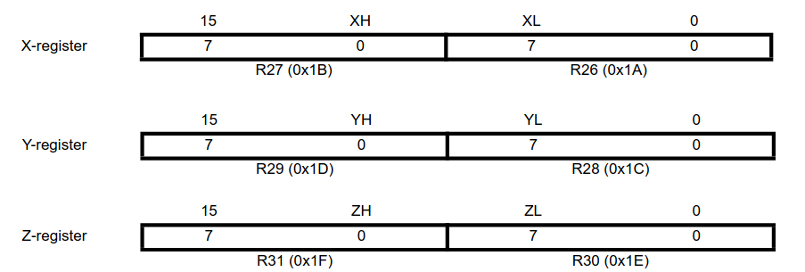
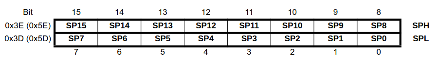

# AVR

The AVR 8 bit processors architecture is described in the datasheet of the Microcontroller itself.

Therefore, for Arduino boards, we will be looking at the [ATMEGA328P Datasheet][atmega328p_datasheet]

[AVR Instruction Set Manual][avr_instruction_set_manual]

## AVR Architecture

The architecture is quite similar to ARM's architecture.

The register file is composed of 32 8-bit registers, from R0 to R31. Memory addresses are 16-bit long.

There are 3 couples of special registers, the X-register, Y-register and Z-register that are designed specially to address memory spaces, where one of them is the 8 MSB bits and the other the 8 LSB bits.

The stack pointer is also implemented as two pairs of 8-bit registers:

## Reset vector

On Section 11, Interrupts we have the Reset and Interrupt vector for the ATmega328P.

I DONT THINK I WILL EVER USE THIS. ABORT AVR ANALYSIS FOR NOW.

<!-- External links -->

[avr_instruction_set_manual]: https://ww1.microchip.com/downloads/en/devicedoc/AVR-Instruction-Set-Manual-DS40002198A.pdf
[atmega328p_datasheet]: https://ww1.microchip.com/downloads/en/DeviceDoc/Atmel-7810-Automotive-Microcontrollers-ATmega328P_Datasheet.pdf
