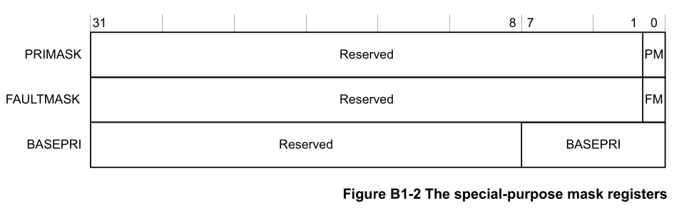
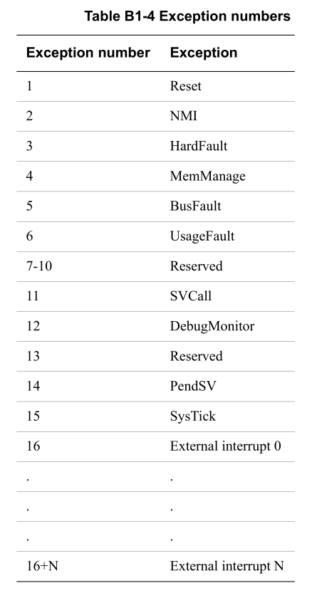

# Cortex-M

Based on the [ARMv7-M Architecture Reference Manual][armv7_arch_ref_manual].

A4.1: "Armv7-M only supports Thumb instructions" (either thumb or thumb2).

B.1.3.1

Supports two operating modes:

* Thread Mode: Is entered on reset, and can be entered as a result of an exception return. Privileged or unprivileged.

* Handler Mode: Is entered as a result of an exception. Always privileged.

Has two stack pointers:

* Main stack pointer: used in hnadler mode or thread mode.

* Process stack pointer: can be only in thread mode.

B1.4.2

The Program Status Register `xPSR` holds the information about the program.

B1.4.3

There are special purpose registers that handle exception priority:

B1.4.4

The `CONTROL` register sets the stack pointer and mode.

## Reset vector

B1.5.2 & B1.5.3

## Steps needed on reset

B1.5.5 & B1.5.6

1. Disable interrupts.
2. Vector table offset to 0.
3. Copy sections from ROM to RAM.
4. Branch to main.
5.

<!-- External links -->
[armv7_arch_ref_manual]: https://developer.arm.com/documentation/ddi0403/ee/?lang=en
