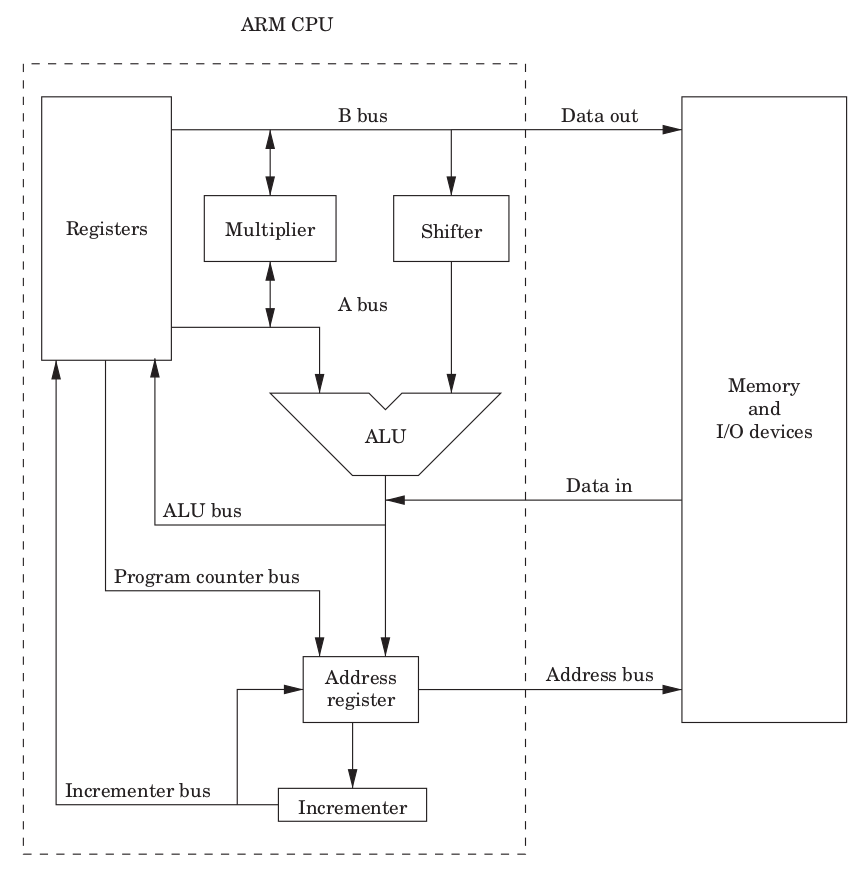
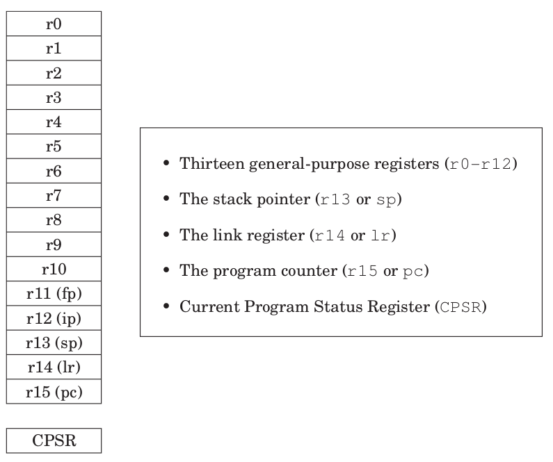

# Assembly instructions

The ARM assembly instructions are all operations that can be performed between registers and memory. The full list of instructions can be consulted at [ARM® Architecture Reference Manual ARMv7-A and ARMv7-R edition][arm_reference_manual]

## Architecture review

The following image shows the ARM CPU architecture.



All ARM instructions depend on two buses: the **A bus** and the **B bus**, both corresponding to registers. Only the *B bus* can store **Data out** to the memory, or be operated by the **Barrel shifter**.

Arithmetic operations can be performed between the A and B buses; meanwhile, their result or the **Data in** from the memory, can be stored in another register, while the **Address register** (program counter) updates the **Address bus**.

All operations, therefore, must be done on registers, and not directly on memory. In the following image there is a list of the available registers under user mode (different modes are explained in the interruptions section).



## Conditional instructions and CPSR

The [CPSR][CPSR] (Current Program Status Registers) holds information about the flow of the program execution:


|     Name     |                Logical instruction                |                                     Arithmetic instruction                                     |
|:------------:|:-------------------------------------------------:|:----------------------------------------------------------------------------------------------:|
| N (Negative) |                        ---                        |                            Bit 31 of result is set (negative number)                           |
|   Z (Zero)   |                Result is all zeros                |                                          Result is "0"                                         |
|   C (Carry)  | After shift operation, "1" was left in carry flag | Result is greater than 32 bits (adding two positive numbers gives a positive and lower number) |
| V (oVerflow) |                        ---                        |             Result is corrupted (Adding two positives numbers gave a negative one)             |

If the instruction ends with and `S`, the flags in the CPSR will be updated. If the instruction ends with one of the following mnemonics, the instruction will be conditionally executed.

| \<cond>  |                Flags               |  Math | Abbreviation meaning |
|:--------:|:----------------------------------:|:-----:|:--------------------:|
|    al    |                 Any                |  ---  |        Always        |
|    eq    |                 Z=1                |  A=0  |       Equal "0"      |
|    ne    |                 Z=0                |  A=0  |     Not Equal "0"    |
|    ge    |     (N=1 & V=1) \| (N=0 & V=0)     | A ≥ B |   Greater or Equal   |
|    lt    |     (N=1 & V=0) \| (N=0 & V=1)     | A < B |       Less Than      |
|    gt    | Z=0 & ((N=1 & V=1) \| (N=0 & V=1)) | A > B |     Greater Than     |
|    le    |  Z=0 \| (N=1 & V=0) \| (N=0 & V=1) | A ≤ B |     Less or Equal    |
|    hi    |              C=1 & Z=0             | A > B |        Higher        |
|    ls    |             C=0 \| Z=1             | A ≤ B |     Lower or Same    |
| hs \| cs |                 C=1                | A ≥ B |    Higher or Same    |
| lo \| cc |                 C=0                | A < B |         Lower        |
|    mi    |                 N=1                | A < 0 |         Minus        |
|    pl    |                 N=0                | A ≥ 0 |         Plus         |
|    vs    |                 V=1                |  ---  |     Overflow Set     |
|    vc    |                 V=0                |  ---  |    Overflow Clear    |

In the case of a conditional instruction that should update the CPSR, for example `addeqs`, the operation will be performed and the CPSR will be updated with its result only if the condition holds true.

The following is an example of conditionally executed instructions:

```arm
ldr     r0, =44
ldr     r1, =55
cmp     r0  r1          // compare r0 and r1
addlt   r0, r0, #11     // r0 = r0 + 11 if previous comparison gave that r0 < r1 (true)
subs    r0, r0, r1      // r0 = r0 - r1 and update flags
addeq   r0, r0, #22     // r0 = r0 + 22 if previous operation was equal to "0" (true)
```

## Addresses

Given a memory address (`Rn`), its contents can be accessed as follows:

|               Syntax                |                                                        Result                                                         |
|:-----------------------------------:|:---------------------------------------------------------------------------------------------------------------------:|
|                `[Rn]`               |                                             Access contents of `Rn`.                                                  |
|          `=<Immediate|symbol>`     |                                  Access contents of the immediate constant or symbol.                                 |
|     `[Rn, #±<offset_12bits>]{!}`    | Access contents of `Rn ± <offset>`. Offset is a 12 bit number [-4095, 4095]. If it ends with `!`, then Rn is updated. |
| `[Rn, ±Rm, <shift_op> #<shift>]{!}` |                   Access contents of `Rn ± (Rm << shift)`. If it ends with `!`, then Rn es updated.                   |
|      `[Rn], #±<offset_12bits>`      |                               Access contents of `Rn`, and then let `Rn = Rn ± <offset>`.                             |
|   `[Rn], ±Rm, <shift_op> #<shift>`  |                             Access contents of `Rn`, and then let `Rn = Rn ± (Rm << shift)`.                          |

## Load and Store register (ldr, str, ldm, stm, pop, push)

For single registers use load `ldr` and store `str` instructions:

```arm
ldr{<cond>}{<size>} Rd, <address>   // Load register: Rd <== *Address
str{<cond>}{<size>} Rd, <address>   // Store register: *Address <== Rd
```

<!-- markdownlint-disable MD007 -->
* `<size>`: By default, it will work on words (32 bits).
    * `b`: unsigned byte.
    * `h`: unsigned half-word.
    * `sb`: signed byte.
    * `sh`: signed half-word.
<!-- markdownlint-enable MD007 -->

For multiple registers:

```arm
ldm<variant> Rd{!}, <register_list> // Load multiple
stm<variant> Rd{!}, <register_list> // Store multiple
```
<!-- markdownlint-disable MD007 -->
* `<variant>`: How to navigate the memory (normally use full descending mode).
    * `ia|fd`: Increment after | full descending.
    * `ib|ed`: Increment before | empty descending.
    * `da|fa`: Decrement after | full ascending.
    * `db|ea`: Decrement before | empty ascending.

* `{!}`: If included, value of Rd is updated with the new address.

* `<register_list>`: enclosed with `{}`, comma separated registers, or range of registers with a `-`, for example `{r1, r3, r6-r8} = r1, r3, r6, r7, r8`.
<!-- markdownlint-enable MD007 -->

To manage stack variables, the preferred way is to use the following instructions. The stack behaves like a LIFO (Last In, First Out).

```arm
pop{<cond>}  <reg_list> // Pop from stack. Equivalent to "ldmfd sp!, <reg_list>"
push{<cond>} <reg_list> // Push to stack. Equivalent to "stmfd sp!, <reg_list>"
```

When using a register list, the lowest register will be stored in the lowest address. For example, if you were to push multiple registers, you'd see in memory:

```arm
`push {r1, r5, r9-11}`
`TOP | r11 | r10 | r9 | r5 | r1 | BOTTOM`.
```

Likewise, if you were to pop multiple registers like `pop {r1, r5, r9-11}`, you will retrieve the lowest address' contents into the lowest register, and end up retrieving everything correctly.

```c
push {r0, r2, r7-r9}    // TOP | r9 | r8 | r7 | r2 | r0 |    | BOTTOM
push {r5}               // TOP | r9 | r8 | r7 | r2 | r0 | r5 | BOTTOM
pop {r5}                // TOP | r9 | r8 | r7 | r2 | r0 |    | BOTTOM   r5=r5
pop {r0, r2}            // TOP | r9 | r8 | r7 |    |    |    | BOTTOM   r0=r0; r2=r2
pop {r7-r9}             // TOP |    |    |    |    |    |    | BOTTOM   r7=r7, r8=r8, r9=r9
```


## Branch (b, bl, bx, blx adr)

A **label** is defined in assembler as a name followed by a colon. Labels are useful to define points in the code to branch to, such as the start of a function, a for loop, or just as a reference.

```arm
// This is a label
my_label:
    nop
```

A branch instruction can be as large as +-32 MBytes in memory, if used with a label. This is because the 32-bit instruction can't hold a 32-bit address, because some of the bits are used to encode the branch instruction itself. If the jump is larger than that, then a **veneer** is used by the compiler, which means that the address is loaded in the register `r12`, and jumps from that register.

```arm
b{<cond>} <label>           // Branch to target label
bl{<cond>} <label>          // Branch and Link. lr = pc (for returning)
bx{<cond>} Rn               // Branch and exchange. Change to Thumb (pc_LSB=1) or ARM (pc_LSB=0) mode.
blx{<cond>} <label>         // Branch, link and exchange. Same as "bx", but lr = pc
adr{<cond>}{s} Rd, <label>  // Copy address from label to register
```

A typical application of the branch instruction is to perform a **for loop**, such as:

```arm
// This is equivalent to 
// for(i=0; i<5; i++) {}

mov r0, #0
loop:
    add r0, r0, #1
    cmp r0, #5 
    blt loop
```

## Data Processing instructions

### Second operand and barrel shifter

The second operand for data processing instruction will go through the barrel shifter, which can do the following in the same clock cycle:

* Define an immediate constant of 8 bits (0-255).

<!-- markdownlint-disable MD007 -->
* Define an immediate constant of 32 bits, only if that value can be constructed by:
    * Rotating right an 8 bit constant for an even number from 0 to 30. (For example, 0x400 = 0x40 ROR 28)
    * Making the 1's complement.
<!-- markdownlint-enable MD007 -->

* Rotate left or right the register `Rm` up to 31 positions.

The list of possible second operands is as follows:

```arm
#<immediate_value>              // Constant value of 8 bits or specially rotated.
Rm                              // Single register
Rm, <shift_op> #<shift_value>   // Rm << shift_value (Rotate register by constant)
Rm, <shift_op> Rs               // Rm << Rs (Rotate register by other register)
Rm, rxx                         // (C|Rm) >> 1 (Rotate right 1 position, including the Carry flag)
```

### Shifting (lsl, lsr, asr, ror, rrx)

All shifting operations can be used as `<shift_op>` with the barrel shifter, or as independent commands.

```arm
Rm, lsl #<value>    // Logical shift left
Rm, lsr #<value>    // Logical shift right
Rm, asr #<value>    // Arithmetic shift right (sign preserved)
Rm, ror #<value>    // Rotate Right
Rm, rrx             // Rotate right by 1 position, but the Carry flag is included.
```

### Comparison (cmp, cmn, tst, teq)

These instructions only update the CPSR. They perform and arithmetic operation, but discard the result.

```arm
cmp{<cond>} Rn, Operand2 // Compare: Rn - op2
cmn{<cond>} Rn, Operand2 // Compare negative: Rn + op2
tst{<cond>} Rn, Operand2 // Test: Rn & Op2
teq{<cond>} Rn, Operand2 // Test equivalence: Rn XOR Op2
```

### Arithmetic (add, adc, sub, sbc, rsb, rsc, neg)

```arm
add{<cond>}{s} Rd, Rn, Operand2 // Add: Rd = Rn + op2
adc{<cond>}{s} Rd, Rn, Operand2 // Add with carry: Rd = Rn + op2 + carry
sub{<cond>}{s} Rd, Rn, Operand2 // Subtract: Rd = Rn - op2
sbc{<cond>}{s} Rd, Rn, Operand2 // Subtract with carry: Rd = Rn - op2 + carry - 1
rsb{<cond>}{s} Rd, Rn, Operand2 // Reverse subtract: Rd = op2 - Rn
rsc{<cond>}{s} Rd, Rn, Operand2 // Reverse subtract with carry: Rd= op2 - Rn + Carry - 1
neg{<cond>}{s} Rd, Rn           // Negate: Rd = -Rn. Same as "rsb Rd, Rn, #0"
```

### Logical (and, orr, eor, orn, bic)

```arm
and{<cond>}{s} Rd, Rn, Operand2 // Bitwise AND: Rd = Rn & op2
orr{<cond>}{s} Rd, Rn, Operand2 // Bitwise OR: Rd = Rn | op2
eor{<cond>}{s} Rd, Rn, Operand2 // Bitwise XOR: Rd = Rn XOR op2
orn{<cond>}{s} Rd, Rn, Operand2 // Bitwise OR negated: Rd = !(Rn | op2)
bic{<cond>}{s} Rd, Rn, Operand2 // Bit clear: Rd = Rn & !(op2)
```

### Data movement

Unlike `ldr` instructions, which load a value from memory, these instructions load a value from other register or use an immediate value. In the case of the instructions of the type `ldr Rn, =<immediate_const>`, they will be assembled into an equivalent `mov Rn, #<immediate_const>` if possible, or load a value in ROM and read it as `ldr Rn, [pc, #offset_pc]`.

```arm
mov{<cond>}{s} Rd, Operand2 // Move: Rd = op2
mvn{<cond>}{s} Rd, Operand2 // Move not: Rd = !op2 (1's complement)
movt{<cond>} Rd, #immed16   // Move top: Rd = (immed16 << 16) | (Rd & 0xFFFF)
```

### Multiplication with 32 bits result (mul, mla)

Registers Rd and Rm should be different, or a compiler warning may appear.

```arm
mul{<cond>}{s} Rd, Rm, Rs       // Multiply: Rd = Rm * Rs
mla{<cond>}{s} Rd, Rm, Rs, Rn   // Multiply and accumulate: Rd = Rm * Rs + Rn
```

### Multiplication with 64 bits result (smull, umull, smlal, umlal)

The 32 LSB will be stored in RdLo, while the 32 MSB will be stored in RdHi (RdHi : RdLo).

```arm
smull{<cond>}{s} RdLo, RdHi, Rm, Rs // Signed multiply long: RdHi : RdLo = Rm * Rs
umull{<cond>}{s} RdLo, RdHi, Rm, Rs // Unsigned multiply long: RdHi : RdLo = Rm * Rs
smlal{<cond>}{s} RdLo, RdHi, Rm, Rs // Signed multiply and accumulate long: RdHi : RdLo = Rm * Rs + RdHi : RdLo
umlal{<cond>}{s} RdLo, RdHi, Rm, Rs // Unsigned multiply and accumulate long: RdHi : RdLo = Rm * Rs + RdHi : RdLo
```

### Division (sdiv, udiv)

```arm
sdiv{<cond>}{s} Rd, Rm, Rn // Signed division: Rd = Rm / Rn
udiv{<cond>}{s} Rd, Rm, Rn // Unsigned division: Rd = Rm / Rn
```

### Misc (clz)

```arm
clz{<cond>} Rd, Rm // Count Leading Zeros: Rd = 31 - Int(log_2(Rm))
```

## System instructions

### Nop (nop)

```arm
nop // No operation, equivalent to "mov r0, r0"
```

### Access CPSR and SPSR (mrs, msr, cps)

```arm
mrs{<cond>} Rd, <special_reg>{_<fields>} // Move status to register: Rd = <special_reg>
msr{<cond>} <special_reg>{_<fields>}, Rd // Move register to status: special_reg = Rd
```

The special register can be:

* CPSR: Current program status register.
* SPSR: Saved program status register.
* xPSR (APSR, IPSR, EPSR): Current program status register, but for Cortex-M processor.
* PRIMASK|FAULTMASK|BASEPRI: Cortex-M interrupt priority.
* CONTROL: Cortex-M operation mode.

The optional <fields\> is any combination of (see CPSR image for meaning):

* `c`: control field.
* `x`: extension field.
* `s`: status field.
* `f`: flag field.

```arm
cps #<mode>  // Change Processor State (to certain operation mode)
cps{ie|id} a|i|f {, #<mode>} // Interrupt Enable or Interrupt Disable any combination of the "Abort, IRQ, or FIQ" interrupts.
```

| \<mode> | User |  FIQ |  IRQ | Supervisor | Abort | Undef | System |
|:-------:|:----:|:----:|:----:|:----------:|:-----:|:-----:|:------:|
|   Code  | 0x10 | 0x11 | 0x12 |    0x13    |  0x17 |  0x1B |  0x1F  |

### Software interrupt (swi, svc, wfi, srs, rfe)

```arm
svc{cond} #<syscall_number> // SuperVisor Call
swi{cond} #<syscall_number> // Software interrupt, same as SVC

SVC_handler:
    ldrb r0, [lr, #-4]  // Get in r0 the syscall_number
    movs pc, lr
```

```arm
WFI{cond} // Wait for interrupt. Suspends execution until IRQ, FIQ or Data Abort.
```

The `srs` instruction (Save Return Status) saves the Link Register (lr) and the SPSR of the current mode in the stack of the <mode\> specified. The `rfe` instruction (Return From Interrupt) is the opposite, and must be used always in conjunction with the `srs` one.

```arm
srs sp{!}, #<mode>  // Store Return Status
cps #<mode>         // Change to different mode
rfe sp{!}           // Return From Exception, using the stack pointer of #<mode>
```

## Recommended bibliography

[Modern Assembly Language Programming with the ARM Processor, Larry D Pyeatt][arm_book]

<!-- External links -->
[CPSR]: https://developer.arm.com/documentation/ddi0406/b/System-Level-Architecture/The-System-Level-Programmers--Model/ARM-processor-modes-and-core-registers/Program-Status-Registers--PSRs-
[arm_book]: https://shop.elsevier.com/books/modern-assembly-language-programming-with-the-arm-processor/pyeatt/978-0-443-14114-0
[arm_reference_manual]: https://developer.arm.com/documentation/ddi0406/cd/?lang=en
