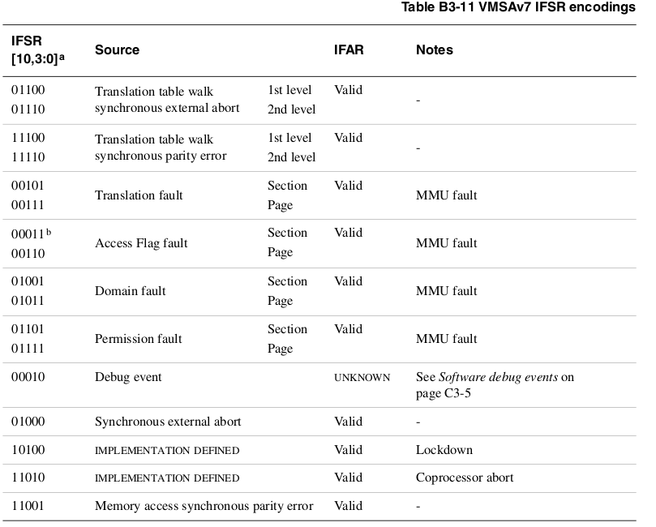

# ARM pagination

In this section we will describe how to implement pagination for virtual memory in an ARMv7 Cortex-A processor using VMSA (Virtual Memory System Architecture). The MMU (Memory Management Unit) is the hardware that handles the translation from VA (Virtual Address) to PA (Physical Address).

## Enabling the MMU

Most operations for memory management are handled by the coprocessor 15 (CP15). ARM has a special instruction to access coprocessor registers:

```arm
mrc{cond} p<coproc_number>, #<opcode1>,  Rm, cp<x>, cp<y>, #<opcode2> // Move to register from coprocessor
mcr{cond} p<coproc_number>, #<opcode1>,  Rm, cp<x>, cp<y>, #<opcode2> // move to coprocessor from register
```

The "opcode1" and "opcode2" are defined for each operation, and the "cp" are the register number in the coprocessor. "Rm" is the ARM register.

### The SCTLR register


This register holds most of the MMU configuration.

```arm
MRC p15,0,<Rt>,c1,c0,0 // Read CP15 System Control Register
MCR p15,0,<Rt>,c1,c0,0 // Write CP15 System Control Register
```

The most relevant to modify (the rest are fine with default value):

|   Name   |         Description         |                         If "0"                        |                       If "1"                      | Default |
|:--------:|:---------------------------:|:-----------------------------------------------------:|:-------------------------------------------------:|:-------:|
|  TE [30] |    Thumb exception enable   |          Exceptions are handled in ARM state          |       Exceptions are handled in Thumb state       |    0    |
| AFE [29] |      Access flag enable     |         No access flag. Full permission range         |   Access flag. Simplified model for permissions   |    0    |
| TRE [28] |       TEX remap enable      | TEX[2:0], C and B are used to describe memory regions | TE[0], C and B are sed to describe memory regions |    0    |
|  HA [17] | Hardware Access Flag Enable |    Hardware management of the access flag disabled    |   Hardware management of the access flag enabled  |    0    |
|   A [1]  |        Alignment bit        |                Alignment fault disabled               |              Alignment fault enabled              |    0    |
|   M [0]  |        MMU enable bit       |                      MMU disabled                     |                    MMU enabled                    |    0    |

## First level page table entry

The first level page table entry describes how a single 1MB VA region is mapped. To be able to represent all the physical memory (4GB), it must have 4K entries, and with 32-bit addresses, occupies 16KB in memory (4 bytes per entry).

The first level page table entry can contain any of the following, determined by the two LSB bits (page offset is a memory address inside the page):

* **Supersection**: 16MB block of memory. As such, 2^24 bits of the VA are used as page offset, and only 2^8 are used as table index. However, this is an invalid bit distribution. If the table has 4K entries, we need at least 2^12 bits of table index. Because of that, the 4 MSB of the page offset and the 4 LSB of the page address are overlapped, making the latter random. Therefore, a supersection must be written 16 times in the table, aligned to a multiple of 16th.

* **Section**: 1MB block of memory. As such, 2^20 bits of the VA are used as page offset, and only 2^12 are used as table index.

* **Page table**: Pointer to a second order page table, with 256 entries. As such, 2^12 bits of the VA are used as table index for the first table, 2^8 bits of the VA are used as an index for the second level page table, and the remaining 2^12 remain free for the page offset.

* **Fault entry**.


## Second level page table entry


The second level page table entries describe how a 4KB VA region is mapped. They contain **physical addresses**.

Second level page table entries have 256 entries, occupying 1KB of memory each.

Can contain any of the following:

* **Large page**: 64KB page. As such, 2^16 bits of the VA are used as page offset, and only 2^16 are used as page index. This is an invalid bit distribution. Coming from the first table, we only had 2^12 bits free. Therefore, the 4 LSB of the table index are used as the 4 MSB of the page offset. Because of that, the large page entry should be repeated 16 times in the table.

* **Small page**: 4KB page. As such, 2^12 bits of the VA are used as page offset, and only 2^20 are used as table index (12bits for first table, and 8bits for second table).

A complete diagram of the VA, table entries for a second order table entry:


## Memory permissions

Failing to follow the permissions defined for a memory page, provided that the domain was configured as client, will result in a "Permission Fault".

### AP: Access properties

Its behavior depends of the configuration of the SCTRL.AFE bit.

If SCTRL.AFE = 0 (No access flag), the complete access properties can be defined.

| AP[2:0] | Privileged permissions | User permissions |
|:-------:|:----------------------:|:----------------:|
|   000   |        No access       |     No access    |
|   001   |       Read/write       |     No access    |
|   010   |       Read/write       |     Read only    |
|   011   |       Read/write       |    Read/write    |
|   100   |            -           |         -        |
|   101   |        Read only       |     No access    |
|   110   |            -           |         -        |
|   111   |        Read only       |     Read only    |

If SCTRL.AFE = 1 (access flag enabled), then the simplified access properties are to be used. Besides, the access flag can be used to know if a memory region was "accessed" since the access flag was set to "0". It's strongly recommended to active the hardware control SCTRL.HA=1.

| AP[2:1] | Privileged permissions | User permissions |
|:-------:|:----------------------:|:----------------:|
|    00   |       Read/write       |     No access    |
|    01   |       Read/write       |    Read/write    |
|    10   |        Read only       |     No access    |
|    10   |        Read only       |     Read only    |

| AP[0] |                                                               Description                                                                |
|:-----:|:----------------------------------------------------------------------------------------------------------------------------------------:|
|   0   |             The memory region was "not accessed". If the memory region is accessed, it will trigger an "Access Flag Fault".              |
|   1   | The memory region was "accessed". Should be set to "1" after the "Access Flag Fault". If SCTRL.HA=1, it's done automatically by hardware |

### XN: Execute never

| XN |                                         Description                                                                 |
|:--:|:-------------------------------------------------------------------------------------------------------------------:|
|  0 |                         The content of the memory can be prefetched.                                                |
|  1 | Trying to fetch an instruction from this address will generate a Prefetch abort exception, with a Permission fault. |

### Domain

A domain encapsulates a whole second level page table, or a section. The domain bits are 4, marking 16 possible domains.

Each of the 16 domains can be marked in the DACR (Domain Access Control Register) as:


| DACRx [1:0] |                               Description                               |
|:-----------:|:-----------------------------------------------------------------------:|
|      00     |               No access. Any access generates Domain Fault              |
|      01     |       Client. Accesses are checked against AP (access permissions)       |
|      10     |                                    -                                    |
|      11     | Manager. Accesses are not checked. Permission Faults can't be generated |

```arm
MRC p15,0,<Rt>,c3,c0,0 // Read CP15 Domain Access Control Register
MCR p15,0,<Rt>,c3,c0,0 // Write CP15 Domain Access Control Register
```

## Memory region attributes

This define how the memory behaves.

### S: shareable, nG: non global, NS: non secure

If "S=0", region is non shareable. If "S=1", region is shareable. Shareable flag is ignored if the memory entry is a "Device" or "Strongly-ordered" memory.

If "nG=0", the translation is global. This means that the TLB value will remain in cache even after a context switch, and can be shared between processes. If "nG=1", the translation is process specific.

If "NS=0", the region is secure. Only matters if the security extensions are enabled.

### TEX, C, B

The behavior of these bits depend on the value of the SCTRL.TRE bit.

If SCTRL.TRE = 0, the TEX remap is disabled.

| TEX[2:0] | C | B |                       Description                       |    Memory type   | Shareable |
|:--------:|:-:|:-:|:-------------------------------------------------------:|:----------------:|:---------:|
|    000   | 0 | 0 |                     Strongly-ordered                    | Strongly-ordered |    Yes    |
|    000   | 0 | 1 |                     Shareable device                    |      Device      |    Yes    |
|    000   | 1 | 0 |     Outer and Inner write through, no write allocate    |      Normal      |   S bit   |
|    000   | 1 | 1 |      Outer and Inner write back, no write allocate      |      Normal      |   S bit   |
|    001   | 0 | 0 |              Outer and Inner non cacheable              |      Normal      |   S bit   |
|    001   | 1 | 1 |        Outer and Inner write back, write allocate       |      Normal      |   S bit   |
|    010   | 0 | 0 |                   Non shareable device                  |      Device      |     No    |
|    1BB   | A | A | AA = Inner attribute; BB = Outer attribute (next table) |      Normal      |   S bit   |

The inner and outer attributes for "AA" and "BB" are defined as such:

| 00 |           Non cacheable          |
|:--:|:--------------------------------:|
| 01 |    Write back, write allocate    |
| 10 | Write through, no write allocate |
| 11 |   Write back, no write allocate  |

If SCTRL.TRE = 1, the TEX remap will be used. Now the values of TEX[2:1] will be user defined, and the values of TEX[0], C and B correspond to one of the 8 configurable memory modes that can be stored in the PRRR (Primary Region Remap Register) and NMRR (Normal Memory Remap Register).


## TTBR: Translation Table base registers

TTBR1 holds the address of the first level page table. This table is used for the operating system and I/O addresses. It has 4K entries, occupying 16KB of memory. Besides, the memory attributes for the PA obtained from the translation table can be defined.


|    Name   |     Description     |                                   If "0"                                   |                                          If "1"                                         | Default |
|:---------:|:-------------------:|:--------------------------------------------------------------------------:|:---------------------------------------------------------------------------------------:|:-------:|
|  NOS [5]  | Not Outer Shareable |      Outer shareable      |                                     Inner shareable                                     |    0    |
| RGN [4:3] |     Region bits     | "00"= Outer Non-cacheable; "01"= Outer write-back write-allocate cacheable | "10"= Outer write-through cacheable; "11"= Outer write-back no write-allocate cacheable |    0    |
|   S [1]   |    Shareable bit    |                                Non-shareable                               |                                        Shareable                                        |    0    |
|   C [0]   |    Cacheable bit    |                             Inner non-cacheable                            |                                     Inner cacheable                                     |    0    |

TTBR0 holds the address of the first level page table of the current process in execution (remember that normally, each process has it's own VA space, so we need one table per process). This table, however, has a catch. The amount of entries of this table can be arbitrarily chosen (see the value "14-N" in the size of the address). All other properties remain the same.


TTBCR (Translation Table Base Control Register) indicates the size of the TTBR0 table. This, then, is dictating the size of the VA for the process. Remember that each entry in the table represent 1MB.


N [2:0]: Determines the size of the first level page table. if "N=0", it will have 4K entries, 16KB of size, so the table index will be 2^12. If "N=7", there will be 32 entries, 128B of size, so the table index will be 2^7.

```arm
MRC p15,0,<Rt>,c2,c0,0 // Read CP15 Translation Table Base Register 0
MCR p15,0,<Rt>,c2,c0,0 // Write CP15 Translation Table Base Register 0

MRC p15,0,<Rt>,c2,c0,1 // Read CP15 Translation Table Base Register 1
MCR p15,0,<Rt>,c2,c0,1 // Write CP15 Translation Table Base Register 1

MRC p15,0,<Rt>,c2,c0,2 // Read CP15 Translation Table Base Control Register
MCR p15,0,<Rt>,c2,c0,2 // Write CP15 Translation Table Base Control Register
```

## Memory faults

Memory faults can cause either a Data abort exception or a prefetch abort exception.

* Alignment Fault: Unaligned memory access (with SCTRL.A == 1).

* Translation Fault: translation table entry is defined as "fault entry" (LSB == 00).

* Access Flag Fault: Access to a table entry with the AP[0] == 0, and the SCTRL.AFE == 1.

* Domain fault: Access to a domain marked as "no access".

* Permission fault: Access to the table entry doesn't follow the AP (access permissions).

* External abort: Produced by memory accesses from external devices.

### Data abort exception

When a Data abort occurs, the values in the DFSR (Data Fault Status Register) will have the reason:


Besides WnR, bit [11] if "0", abort caused by read access, if "1", abort caused by write access.

The DFAR (Data Fault Address Register) will have the address that caused the exception, if the access was synchronous.

```arm
MRC p15,0,<Rt>,c5,c0,0 // Read CP15 Data Fault Status Register
MCR p15,0,<Rt>,c5,c0,0 // Write CP15 Data Fault Status Register

MRC p15,0,<Rt>,c6,c0,0 // Read CP15 Data Fault Address Register
MCR p15,0,<Rt>,c6,c0,0 // Write CP15 Data Fault Address Register
```

### Prefetch abort exception

When a Prefetch abort occurs, the IFSR (Instruction Fault Status Register) will have the reason:



The IFAR (Instruction Fault Address Register) holds the VA that caused exception, if it was synchronous.

```arm
MRC p15,0,<Rt>,c5,c0,1 // Read CP15 Instruction Fault Status Register
MCR p15,0,<Rt>,c5,c0,1 // Write CP15 Instruction Fault Status Register

MRC p15,0,<Rt>,c6,c0,2 // Read CP15 Instruction Fault Address Register
MCR p15,0,<Rt>,c6,c0,2 // Write CP15 Instruction Fault Address Register
```

## Special instruction: DSB and ISB

DSB (Data Synchronization Barrier). No instruction will execute until this instruction completes. This instruction completes when:

* All memory accesses before this instruction are complete.
* All Cache, branch and TLB maintenance operations complete.

ISB (Instruction Synchronization Barrier). Flushes the pipeline, so all new instructions must be re-fetched from cache or memory.

## Cortex-R MPU: a review

The Cortex-R, as a real time device, doesn't have time for this "pagination" stuff. The PMSA (Protected Memory System Architecture, replaces VMSA) uses the MPU (Memory Protection Unit, replaces MMU) to statically define "memory regions" and places the code and data on those regions. These regions are defined by its base address, arbitrary size, attributes and permissions; most of which are the same as described above.
