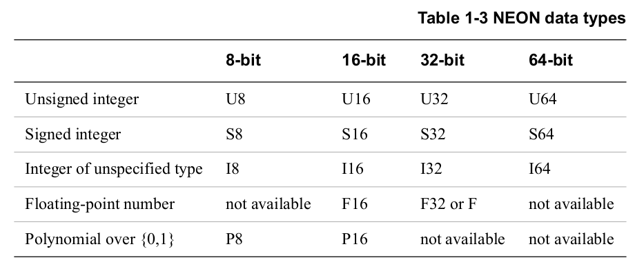

# SIMD: Single Instruction Multiple Data

In ARM, SIMD is implemented in three different ways:

* ARM SIMD instructions: integrated assembly instructions.

* With NEON: a special bank of SIMD registers.

* With FPU: a hardware floating point unit.

This topic is better explained by example, so let's start.

## ARM SIMD instructions

In ARM, registers have 32 bits. If we wanted to operate with pixels in an image, which only use 8 bits, then we would be wasting 24 bits per operation. So, a sensible thing to do would be to put four pixels in a single register, and do four 8-bit operations with a single 32-bit register. This can be done with the instruction `UADD8` as follows:

```arm
ldr r1, =0x11223344
ldr r2, =0x55667788
uadd8 r0, r1, r2    // r0 = 0x6688AACC
```


A small list of these instructions, just to have an idea:

```arm
uadd16 r0, r1, r2   // r0[0:15] = r1[0:15] + r2[0:15]
uadd8 r0, r1, r2    // r0[0:7] = r1[0:7] + r2[0:7]
uhadd16 r0, r1, r2  // r0[0:15] = (r1[0:15] + r2[0:15])/2
uhadd8 r0, r1, r2   // r0[0:7] = (r1[0:7] + r2[0:7])/2
```

## Introduction to NEON and VFP's bank of registers

NEON is the name given to the "Advanced SIMD extension" from ARM. It's implemented on coprocessors 10 and 11 `cp10, cp11`. In addition, the VFP (Virtual Floating Point) extension is also implemented on coprocessors `cp10, cp11`. A CPU might have both NEON and VFP, one of them, or none. These coprocessors have their own bank of registers, therefore, NEON and VFP operations are not performed using the general purpose registers `{r0-r15}`.

The NEON register bank consists of 32 64-bit registers, which can be seen as:

* Sixteen 128-bit "quad word (Q)" registers `Q0-Q15`.
* Thirty two 64-bit "double word (D)" registers `D0-D31`

Meanwhile, the VPF register bank consists of 16 64-bit registers, which can be seen as:

* Sixteen 64-bit "double word (D)" registers `D0-D15`.
* Thirty two 32-bit "single word (S)" registers `S0-S31`.

Notice that `D0-D15` are shared between NEON and VFP.


### NEON fundamentals

All NEON or VFP instructions start with a `V`, for "vectorized operation". Each instruction must indicate the size and the number of the registers, as well as data type. Output and input registers might be of different size.

```arm
VADD.I16 Q0, Q1, Q2     // Add eight 16-bit integers
VADD.U8 D0, D1, D2      // Add eight 8-bit unsigned integers
VMULL.S16 Q2, D8, D9    // Multiply four 16-bit signed integers, and store the result in four 32-bit spaces.
```

To set a *scalar* into a NEON register, the data type, the register number, and the index must be specified:

```arm
VMOV.8 D0[3], R3    // Move the 8 LSB from R3 into the fourth byte of the register D0.
```

So, data types are separated from the instruction name by a dot. All possible data types are:



Sometimes, only the size of the data type is needed. In that case, the syntax is `.8 ; .16 ; .32`, etc.

### Enabling NEON

These are the GCC compiler flags needed:

```bash
-ftree-vectorize    # Enables automatic vectorization while compiling
-mfpu=neon          # Enables NEON instructions
-mcpu=cortex-a7     # Indicates the CPU
```

This is a sample initialization code:

```arm
VMRC p15,0,r0,c1,c0,2   // Read CPACR
ORR r0,r0,#0x00f00000   // Enable full access to NEON/VFP by enabling access to Coprocessors 10 and 11
MCR p15,0,r0,c1,c0,2    // Write CPACR
ISB
MOV r0,#0x40000000
VMSR FPEXC,r0           // Set EN bit in FPEXC
```

The special NEON registers are described in the next sub-sections.

#### CPACR: Coprocessor Access Control Register

This register enables and disables access to all coprocessors, except the 15th one. The value written in each coprocessor state indicate the access permissions:

* `00`: Access denied. Any attempt to access the coprocessor generates an Undefined instruction exception.
* `01`: Privileged access only. Accessing in User mode triggers an Undefined Instruction exception.
* `10`: Reserved.
* `11`: Full access.


#### FPEXC: Floating Point Exception Register

* `[30]` Enable bit. If "1", the NEON unit and VFP are enabled.

#### FPSCR: Floating Point Status and Control Register

This register is the same as the CPSR (Current Program Status Register), but used for the NEON registers. The relevant bits are:

* `[31:28]` N, Z, C and V flags for NEON operations. They cannot be used to control conditional execution until they have been copied into the status flags in the CPSR.

* `[27]` QC, cumulative saturation. It's set if saturation occurs in NEON saturating instructions.

* `[15, 12:8, 7, 4:0]` Enable exception trapping (division by zero, overflow, underflow, etc).

## NEON instructions syntax

The general syntax is:

```arm
V{mod}<op>{shape}.<data_type> Q0, Q1, Q2
```

### Modifiers

* `Q`: Saturation. The result is set to either the maximum or minimum if it exceeds the representable range.

* `H`: Halved. Divide all results by 2 (in reality, shift right one space).

* `D`: Double before saturation.

* `R`: Rounded.

### Shape

All instructions have the same number of operands and results, but no necessarily the same size. If <shape\> is specified, then different size registers can be used for input and output:

* `L`: Long. Result is twice as big as input. `VADDL.S16 Q0, D2, D3`.

* `N`: Narrow. Result is half as big as input. `VADDN.S16 D0, Q1, Q2`.

* `W`: Wide. Result and first operand are twice as big as the second operand. `VAddW.S16 Q0, Q1, D4`.

## NEON and ARM pipeline

The flow of the program may have several ARM and NEON instructions. The NEON instructions are read from the ARM code flow, and then they are added to the *NEON instruction queue* of the coprocessors 10 and 11. Next, the main core executes the following ARM instruction in the next clock cycle, while the NEON instruction is being processed in parallel, which might take around 20 cycles.

ARM code will continue to execute normally until either the NEON queue gets full, or an operation between NEON and ARM general purpose registers is requested. This last condition puts the instruction as the last element in the NEON queue, and the ARM code flow can't execute the next instruction until all pending NEON instructions are finished.

## NEON instruction set

Only a subset will be specified. A complete list can be found in the [NEON Programmer's Guide][neon_programmers_guide]. Most instructions specified here support the shape and modifiers.

All conditional execution is checked against the ARM CPSR, not the NEON FPSCR. If you want to check if a NEON instruction produced certain result, you have two options:

* All logical NEON instructions return "1" if true, or "0" if false, so you may check against that.
* Copy FPSCR ALU flags into the CPSR. This operation will halt the ARM core until all NEON instructions are complete.

### General data processing instructions

```arm
vcvt{cond}.<type1>.<type2> qd, qm     // Convert Vector from data_type2 to data_type1
```

```arm
vdup{cond}.<size> qd, <Rm | Dm[x]>    // Duplicate general purpose register into NEON register.
```

```arm
vmov{cond}.<type> qd, <#imm | Qm>  // Move immediate value or reg to NEON reg.
vmvn{cond}.<type> qd, <#imm | Qm>  // Move ~imm value to NEON reg (negated).
```

### Shift instructions

```arm
vshl{cond}.<type> Qd, Qm, #imm  // Shift left
vshr{cond}.<type> Qd, Qm, #imm  // Shift right
```

### Logical and compare

```arm
If true, "Qd" will be equal to all "1" in the corresponding bits for each element.
vacgt.<type> Qd, Qn, Qm     // |Qn| > |Qm|
vacge.<type> Qd, Qn, Qm     // |Qn| >= |Qm|
vcgt.<type> Qd, Qn, Qm      // Qn > Qm
vcge.<type> Qd, Qn, Qm      // Qn >= Qm
vclt.<type> Qd, Qn, Qm      // Qn < Qm
vcle.<type> Qd, Qn, Qm      // Qn <= Qm
vceq.<type> Qd, Qn, Qm      // Qn == Qm
vceq.<type> Qd, Qn, Qm      // Qn & Qm
```

```arm
vand{cond}.<type> Qd, Qn, Qm            // Qd = Qn & Qm
vorr{cond}.<type> Qd, Qn, <#imm | Qm>   // Qd = Qn | Qm
vbic{cond}.<type> Qd, <#imm | Qm>       // Bit clear. Qd &= ~(imm)
veor{cond}.<type> Qd, Qn, Qm            // Qd = Qn xor Qm
vorn{cond}.<type> Qd, Qn, Qm            // Qd = Qn | ~(Qm)
```

### Arithmetic instructions

```arm
vaba{cond}.<type> Qd, Qn, Qm    // Qd = Qd + |Qn - Qm|
vabd{cond}.<type> Qd, Qn, Qm    // Qd = |Qn - Qm|
vabs{cond}.<type> Qd, Qn        // Qd = |Qn|
```

```arm
vadd{cond}.<type> Qd, Qn, Qm    // Qd = Qn + Qm
vsub{cond}.<type> Qd, Qn, Qm    // Qd = Qn - Qm
vneg{cond}.<type> Qd, Qn        // Qd = ~Qn
```

```arm
vmul{cond}.<type> Qd, Qn, <Qm | Dm[x]>    // Qd = Qn * Qm
vmla{cond}.<type> Qd, Qn, <Qm | Dm[x]>    // Qd = Qd + Qn * Qm
vmls{cond}.<type> Qd, Qn, <Qm | Dm[x]>    // Qd = Qd - Qn + Qm
```

```arm
vmax{cond}.<type> Qd, Qn, Qm    // Qd = Max{Qn, Qm}
vmin{cond}.<type> Qd, Qn, Qm    // Qd = Min{Qn, Qm}
```

### Load and Store instructions

These instructions are used to move values from NEON registers to ARM registers and vice versa. All these instructions stall the ARM code execution until all NEON operations in the queue complete.

```arm
vmov{cond} Dm, Rd, Rn           // Dm[63:32] = Rd; Dm[31:0] = Rn
vmov{cond} Rd, Rn, Dm           // Rd = Dm[63:32]; Rn = Dm[31:0]
vmov{cond}.<type> Dn[x], Rd     // Dn[x] = Rd
vmov{cond}.<type> Rd, Dn[x]     // Rd = Dn[x]
```

Loading/storing single register.

```arm
vldr{cond} Dm, [Rn{, #offset}]  // Dm = *Rn
vldr Dm, =<label>               // Dm = *label
vstr Dm, [Rn{, #offset}]        // *Rn = Dm
vstr Dm, =<label>               // *label = Dm
```

Loading/storing multiple registers.

```arm
vldm<mode> Rn{!}, <reg_list>
vstm<mode> Rn{!}, <reg_list>
vpop <reg_list>
vpush <reg_list>
```

Loading from memory location. `<D_reg_list>` is a list of "n" "Double word" registers, where "n" is given by the instruction name from 1 to 4. They can be specified in three ways, which vary the instruction functionality:

* `{D0[x], D1[x]}`: Load one single element from memory `[Rn]` to the specified section of the register.

* `{D0[], D1[]}`: Load one single element from memory `[Rn]` into all sections of the register.

* `{D0, D1}`: Load multiple elements from memory `[Rn]` into the various sections of the registers.

All data must be 8-byte aligned.

```arm
vld1{cond}.<type> <D_reg_list>, [Rn]{!}
vld2{cond}.<type> <D_reg_list>, [Rn]{!}
vld3{cond}.<type> <D_reg_list>, [Rn]{!}
vld4{cond}.<type> <D_reg_list>, [Rn]{!}
```

Storing from memory location.

```arm
vst1{cond}.<type> <D_reg_list>, [Rn]{!}
vst2{cond}.<type> <D_reg_list>, [Rn]{!}
vst3{cond}.<type> <D_reg_list>, [Rn]{!}
vst4{cond}.<type> <D_reg_list>, [Rn]{!}
```

Example

```arm
.text
ldr r0, =neon_load
vld2.u16 {d0, d1}, [r0] // D0 = 1 | 2 | 3 | 4 ; D1 = 10 | 20 | 30 | 40
vadd.u16 d0, d0, d1     // D0 = 11 | 22 | 33 | 44
vst1.u16 {d0}, [r0]
ldrh r1, [r0], #2
ASSERT_EQ r1, #0x11
ldrh r1, [r0], #2
ASSERT_EQ r1, #0x22
ldrh r1, [r0], #2
ASSERT_EQ r1, #0x33
ldrh r1, [r0], #2
ASSERT_EQ r1, #0x44

.data
.balign 8
neon_load:
    .hword 0x1
    .hword 0x10
    .hword 0x2
    .hword 0x20
    .hword 0x3
    .hword 0x30
    .hword 0x4
    .hword 0x40
```

Loading/storing special registers.

```arm
vmrs Rd, FPSCR  // Rd = FPSCR
vmsr FPSCR, Rd  // FPSCR = Rd
```

## NEON intrinsics (C library)

Including the header file `arm_neon.h`, you can use NEON in the C programming language. All functions and data types mapped one to one with a corresponding NEON instruction or register, so no overhead is added.

Next, a full list of the NEON data types.


To access *scalar* values, as `Dm[x]`, each data type is defined as a struct with a `val` vector member:

```c
struct int16x4_t {
    int16_t val[4];
}
```

Variables are defined as any other normal variable.

The NEON instructions are called with the same name, but as C functions with arguments. For example, the following are the same in C or assembly:

```c
#include <arm_neon.h>
uint8x8_t a, b, c;
a = vdup_n_u8(0x12);
b = vl
c = vadd_u8(uint8x8_t a, uint8x8_t b);
```

```arm
vadd d0, d1, d2
```

## Recommended bibliography

[Introducing NEON Development Article][neon_intro_article]: An introduction to SIMD and NEON.

[NEON Programmer's Guide][neon_programmers_guide]: This is the most complete one, with the full instruction set and examples.

<!--External links-->
[neon_programmers_guide]: https://documentation-service.arm.com/static/63b439743f28e5456434e408?token=
[neon_intro_article]: https://developer.arm.com/documentation/dht0002/a
