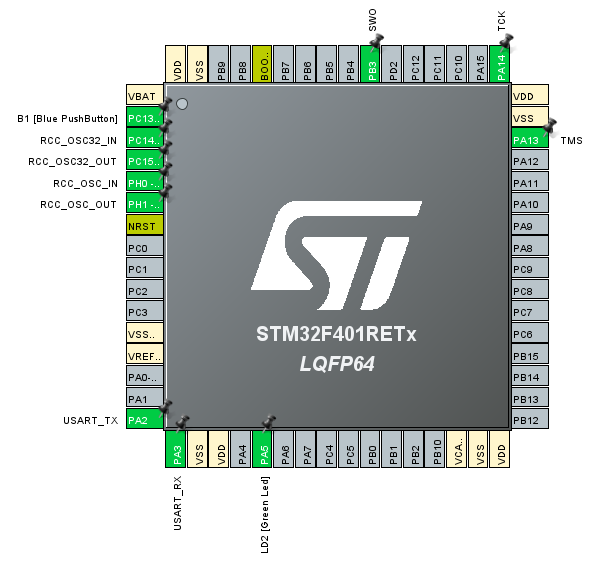

# Bare-metal

This guide explains all the topics related to code execution in an embedded device.

This sections is going to be a chronicle about the STM32 Nucleo Board.

## The STM32F401 Nucleo Board

Congratulations, you just bought the [STM32F401 Nucleo Board][nucleo]!


Following the instructions on the webpage, you install the [STM32Cube IDE][cube_ide], and start a sample project. Then, configure the pinout using the GUI, and write a simple blinking LED as such:

```c
HAL_Delay(1000);
HAL_GPIO_TogglePin(LD2_GPIO_Port, LD2_Pin);
```



Then, it is as simple as pressing the "run" button on the IDE, and the code is compiled and flashed into the device.

However, there are a lot of things that were done under the hood for us. Just look at the project contents:


From there, we can infer that the following contents were auto-generated:

* `startup_stm32f401retx.s`: Bootloader written in assembler, that moves the code from FLASH to RAM to be executed.
* `STM32F401RETX_FLASH.ld` and `STM32F401RETX_RAM.ld`: Linker scripts.
* `Drivers`: Both the CMSIS drivers and the STM HAL library.
* All source files: Handle clock and peripheral initialization.
* A cross-compiler toolchain was built for us: When inspecting the terminal, you can see calls to `arm-none-eabi-gcc`.
* Debugger and flasher.

It would be foolish to rewrite from scratch the bootloader and linker scripts, adn the GUI for configuring the board is quite convenient!

Therefore, what we will do is the following:

1. Use the CubeIDE to generate all the required files.
2. Configure the device with all the peripherals and pins as needed.
3. Make sure that you have a minimal example working.
4. Migrate everything to your own IDE.

## Installing cross-compiler toolchain

Let's use [crosstool-NG][crosstool] to install the required toolchain.

Install a released tarball as indicated in the [installation guide][crosstool_install].

```bash
./configure --enable-local
make
./ct-ng help

./ct-ng list-samples
Status  Sample name
[L...]   aarch64-ol7u9-linux-gnu
[L...]   aarch64-ol8u10-linux-gnu
[L...]   aarch64-ol8u6-linux-gnu
[L...]   arm-none-eabi
[L...]   riscv64-unknown-elf
[L...]   riscv64-unknown-linux-gnu


./ct-ng show-arm-none-eabi
[L...]   arm-none-eabi
    Languages       : C,C++
    OS              : bare-metal
    Binutils        : binutils-2.45
    Compiler        : gcc-15.2.0
    Linkers         :
    C library       : newlib-4.5.0.20241231 picolibc-1.8.10
    Debug tools     :
    Companion libs  : gmp-6.3.0 isl-0.27 mpc-1.3.1 mpfr-4.2.2 newlib-nano-4.5.0.20241231 newlib-nano-4.5.0.20241231 zlib-1.3.1 zstd-1.5.7
    Companion tools :

./ct-ng arm-none-eabi
```

```bash
./ct-ng nconfig
```

Modifications:

Paths and misc options
    -> Local tarballs directory (<some empty folder that MUST exists>)
    -> Prefix directory (${CT_PREFIX:-<path_to_repo>/x-tools}/${CT_HOST:+HOST-${CT_HOST}/}${CT_TARGET})

Target options
    -> Default instruction set mode (thumb)
    -> Build a multilib toolchain (N)
    -> Use the MMU (N)
    -> Emit assembly for CPU (cortex-m4)
    -> Use specific FPU (fpv4-sp-d16)
    -> Floating point: (hardware (FPU))

Toolchain options
    -> Tuple's vendor string (cotti)
    -> Tuple's alias (arm-cortex-m4) # Toolchain will be called like arm-cortex-m4-gcc

C-library
    -> C library (newlib)

C compiler
    -> Build libstdcxx (N)

Companion libraries
    -> newlib-nano (N)
    -> picolibc (N)

Debug facilities
    gdb (Y)

After that, build the toolchain with:

```bash
./ct-ng build
```

```bash
arm-none-eabi-gcc "../Core/Src/main.c" -mcpu=cortex-m4 -std=gnu11 -g3 -DDEBUG -DUSE_HAL_DRIVER -DSTM32F401xE -c -I../Core/Inc -I../Drivers/STM32F4xx_HAL_Driver/Inc -I../Drivers/STM32F4xx_HAL_Driver/Inc/Legacy -I../Drivers/CMSIS/Device/ST/STM32F4xx/Include -I../Drivers/CMSIS/Include -O0 -ffunction-sections -fdata-sections -Wall -fstack-usage -fcyclomatic-complexity -MMD -MP -MF"Core/Src/main.d" -MT"Core/Src/main.o" --specs=nano.specs -mfpu=fpv4-sp-d16 -mfloat-abi=hard -mthumb -o "Core/Src/main.o"

arm-none-eabi-gcc -o "hello_world.elf" @"objects.list"   -mcpu=cortex-m4 -T"/home/cotti/STM32CubeIDE/workspace_1.19.0/hello_world/STM32F401RETX_FLASH.ld" --specs=nosys.specs -Wl,-Map="hello_world.map" -Wl,--gc-sections -static --specs=nano.specs -mfpu=fpv4-sp-d16 -mfloat-abi=hard -mthumb -Wl,--start-group -lc -lm -Wl,--end-group
```

!!! note
    If you have doubts on what to configure here, check the compilation logs from the vendor IDE.

<!-- External links -->
[nucleo]: https://www.st.com/en/evaluation-tools/nucleo-f401re.html
[cube_ide]: https://www.st.com/en/development-tools/stm32cubeide.html
[crosstool]: https://crosstool-ng.github.io/
[crosstool_install]: https://crosstool-ng.github.io/docs/install/#download-tarball
