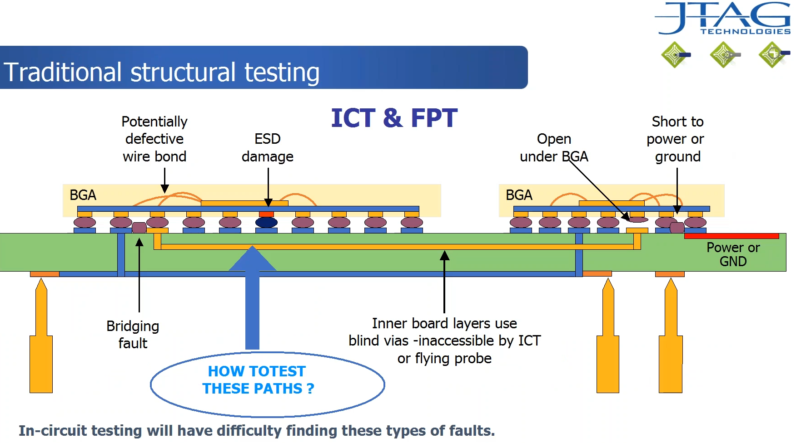
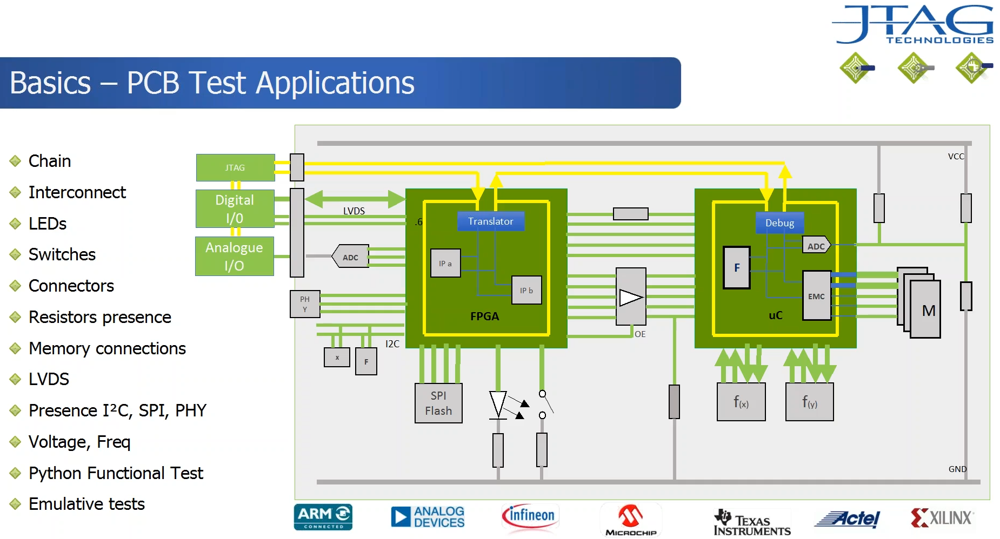
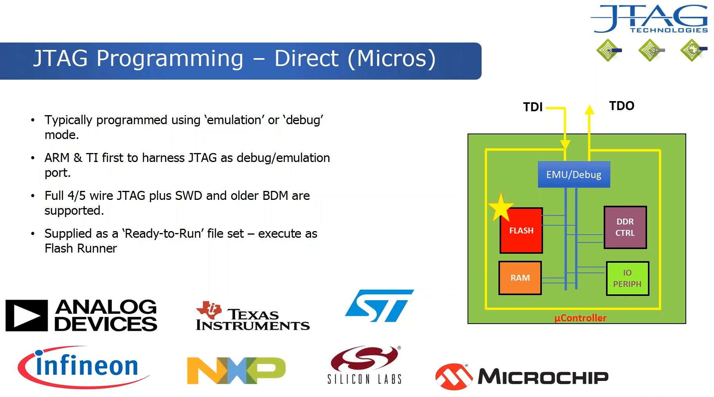

# JTAG/Boundary-scan

## Background

JTAG/Boundary-scan comes from the [1149.1-2013 - IEEE Standard for Test Access Port and Boundary-Scan Architecture][ieee_jtag].

The actual technology is Boundary-scan, JTAG refers to the creators: the Joint Test Action Group. However, nowadays every talks about the "JTAG technology".

Boundary-scan was born as a solution to properly test embedded devices. At the beginning, when almost all components were Through-Hole, you could use a "bed of nails" to access all the pins of an IC and forcefully inject and read signal values. Nowadays, with all components being SMD, it is not possible. How can you know if one of the BGA balls from the chip is not soldered properly?

Boundary-scan, as its name implies, can read and write all the externals pins of an IC (in the "boundary" of the IC). You connect to the device by a 5-signal Test Access Port (TAP). Configure some internal registers, and then choose the electrical state of the pins by writing to the TDI pin, and read their electrical state from the TDO pin.

Boundary-scan relies on the fact that each pin of the IC must have a multiplexor that connects it to the Core or to a Drive/Sense cell (D/S cell).

The following image shows a full board being tested with Boundary-scan. In yellow lines, all the external pins of the devices are being driven to connect to every component of the board: memories, I2C devices, etc.

I recommend watching the [Webinars from JTAG Technologies][webinars], specially the "Introduction to boundary-scan" and "Programming Devices via the JTAG Interface". Also, the [JTAG Technologies][jtag_tech] page in general has good "general culture" documentation on this topic that is worth looking, specially the [tutorial][jtag_tutorial] and the [boundary-scan overview][jtag_overview]

## JTAG programming

There are two ways to program a device:

The **indirect** method uses the Boundary-scan register to drive external boot devices connected to pins of the IC, like a NOR/NAND flash or a serial flash with I2C/SPI interface.

The **direct** method uses the Emulation/Debug mode of the JTAG standard. It is used to control things inside the Core, like an integrated Flash in the chip that cannot be accessed from externals pins.

## Physical connection

The Test Access Port (TAP) only has 4 compulsory pins, with an optional fifth:

* TCK (Test Clock).
* TMS (Test Mode Select). Changes on rising edge.
* TDI (Test Data Input). Changes on rising edge.
* TDO (Test Data Out). Changes on falling edge.
* TRST* (Test Reset). Optional, resets controller when "0".

## State machine

The state diagram for boundary-scan is shown below (IEEE section 6):

It has two modes: either to read the data registers (DR) or the instruction registers (IR).

During the *Capture-DR*, data is loaded into the shift register.

When in *Shift-DR*, the test data register connected between TDI and TDO shifts data from TDI, one stage toward its serial output, and to TDO.

The state machine will enter *Test-Logic-Reset* when TMS is held high for at least five rising edged of TCK.

### Instruction registers

Instructions define what data register is connected between the TDI and TDO ports, as well as the state of the Drive/Select cells.

The full list of instructions can be found in Section 8 of the IEEE norm.

TODO make a table.

BYPASS:
IDCODE:
RUNBIST:
(etc):

### Data registers

TODO

### BSDL: Boundary Scan Description Language

<!-- External links -->
[ieee_jtag]: https://ieeexplore.ieee.org/document/6515989
[webinars]: https://www.jtag.com/recorded-webinars/
[jtag_tech]: https://www.jtag.com/
[jtag_tutorial]: https://www.jtag.com/what-is-jtag-testing-of-electronics-tutorial/
[jtag_overview]: https://www.jtag.com/boundary-scan/
