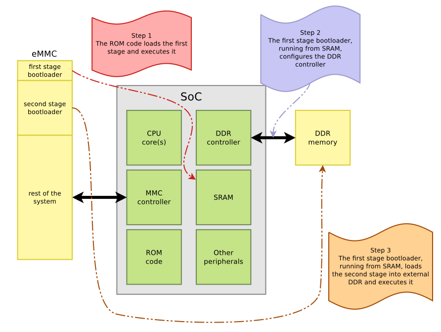
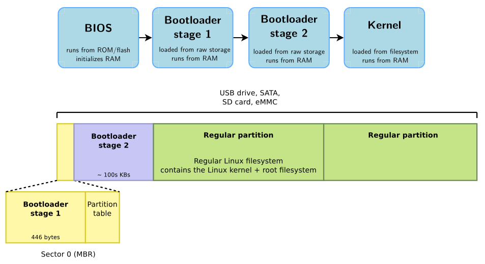
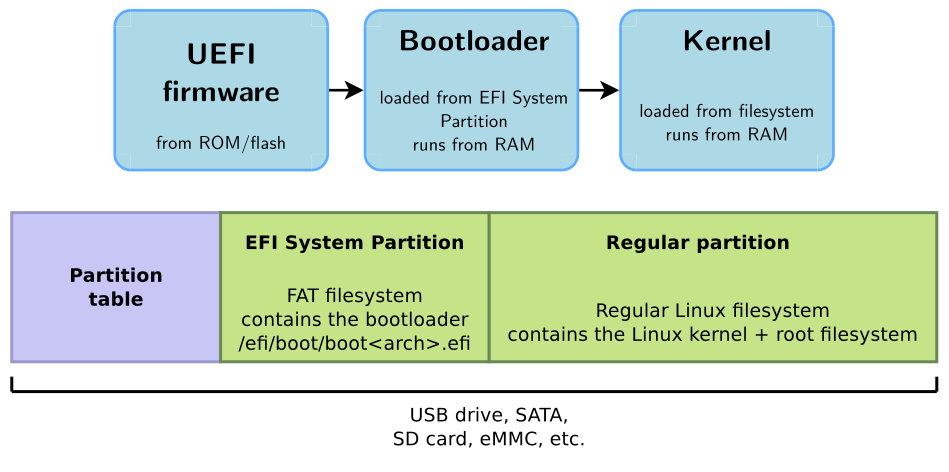
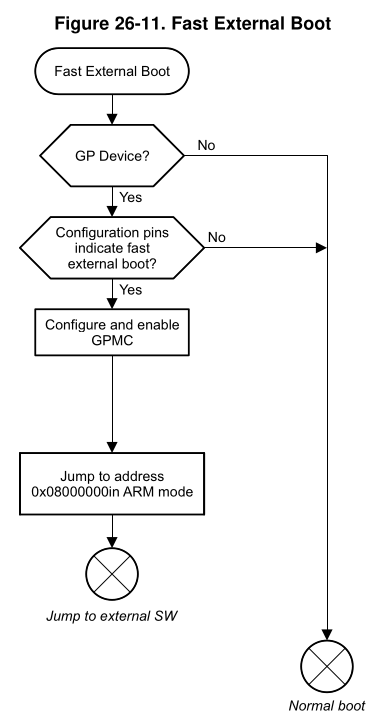
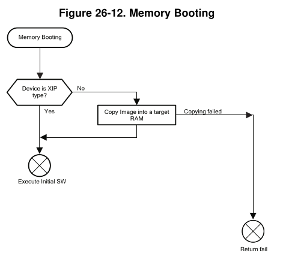
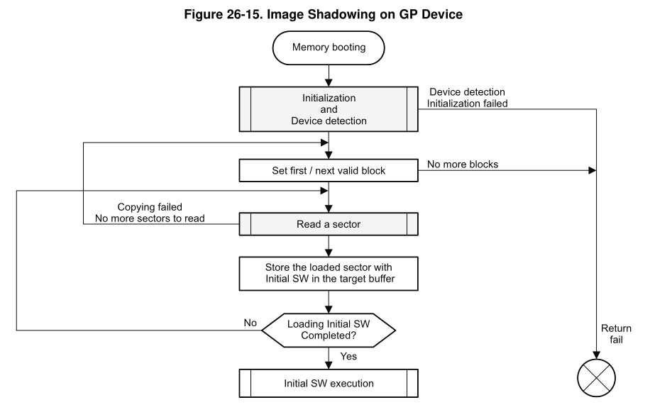
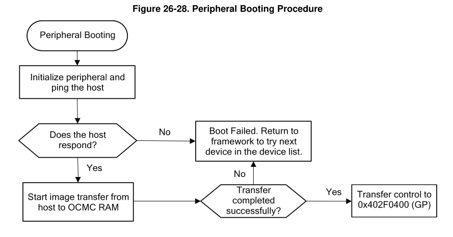
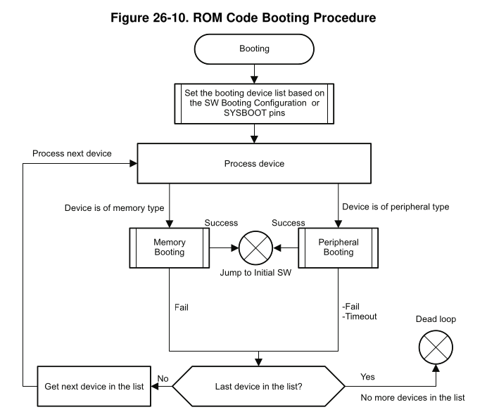
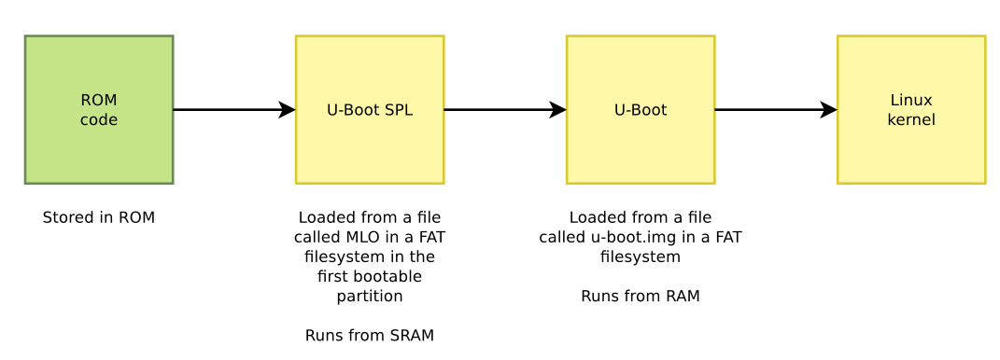

# Embedded Linux bootloader

In contrast with a bare-metal device, the bootloader for an embedded Linux application has a lot more responsibilities, which include:

* Basic hardware initialization, e.g RAMs, UARTs, SPIs, Ethernet, MMC/eMMC, USBs, etc.
* Loading an application binary from flash, network or another type of non-volatile storage to RAM.
* Present a shell with commands to read/write/inspect memory, perform hardware testing/diagnostics, and to choose the operating system to load.
* Decompression and execution of the application binary.

The end goal of the bootloader is to execute the Linux kernel. After that, it is usually unloaded from memory[^1].

First, a historical review of bootloaders with [BIOS][bios_section] and [UEFI][uefi_section] is presented. Then, the usual two stage booting sequence will be review, which consists of:

1. [ROM code][rom_code_section].
2. First stage bootloader or [Secondary Program Loader (SPL)][spl_section].
3. Second stage bootloader or [U-Boot][u-boot_section].



## BIOS booting

[BIOS][bios] (Basic Input Output System) was the original bootloader. It was a closed-source, hardware dependent code of exactly 446 bytes, stored in a special first sector of storage devices called **Master Boot Record (MBR)**, where the partition table for the RAM and its initialization code were stored. Then, it jumped to a second stage bootloader, which was much bigger and could do all the things required for booting the kernel image.



## UEFI booting

[UEFI][uefi] (Unified Extensible Firmware Interface) also boots the kernel image, but it provides runtime services for the operating system; therefore, not stopping its execution and remaining in memory after the OS booted. It is stored in a special MBR partition, formatted with a FAT filesystem.



UEFI provides [Advanced Configuration and Power Interface (ACPI)][acpi] tables, with descriptions of the hardware that cannot be dynamically discovered at runtime. Conceptually, ACPI serves the same role as Device trees for discovering and configuring hardware components.

<!-- (TODO device tree link). -->

However, UEFI + ACPI is mainly used for desktop and servers. The de-facto standard for booting embedded devices is U-Boot + Device trees.

## The vendor-specific ROM code

Most embedded processors, after a power up, execute a **ROM code** that implements the initial steps of the boot process. This code is written by the manufacturer and is directly built into the processor. It cannot be changed or updated, and its behavior is described in the chip's datasheet.

Depending on the device you are booting from[^2], it mainly has three behaviors:

1. ^^Fast external booting^^: The bootloader does the bare minimum and jumps straight to SRAM. The user is expected to write its own bootloader from scratch.

    

2. ^^Memory booting^^: It depends on the kind of device:

    * XIP (eXecute-In-Place) memory (e.g. NOR flash or SRAM): code is executed straight from it.
    * Block storage or SPI memory (e.g. NAND flash, MMC/SD cards, SPI NAND or SPI EEPROM): code needs to be copied to RAM (or "shadowed") before being executed.

    

    

3. ^^Peripheral booting^^: Downloads the code from the host through an Ethernet/USB/UART interface and stores it in RAM. It usually requires a vendor-specific tool because it uses a vendor-specific protocol. Some examples are:

    * STM: [STM32 Cube Programmer][stm32_cube_programmer].
    * NXP: [uuu or mfgtools][uuu].
    * Microchip: [SAM-BA][samba]

    Bootlin developed an open-source vendor-agnostic replacement: [snagboot][snagboot].

    This method is usually used as a recovery mechanism, to reflash a bootloader into a non-volatile storage device.

    

Regardless of the type of booting, the steps done by the ROM code can be summarized in:

1. Move the ROM code to the internal SRAM of the chip.
2. Initialize the most essential peripherals (Power, Clock, GPIO) and the ones required to fetch the next bootloader stages (UART, MMC, NAND/NOR flash, etc).
3. Read the BOOTx GPIO pins, whose electrical value determine the order of the list of devices from where the second stage bootloader is going to be executed.
4. Fetch and execute the next bootloader stage.



## Secondary Program Loader (SPL)

The SPL[^3], is a smaller code that prepares the system to run U-Boot. For example, in the [Am335x Sitara][am335x_trm], as stated in chapter 26.1.4.2, the SRAM module used for booting only has up to 109KB, which might not be enough to load the U-Boot binary. Therefore, the SPL is responsible for initializing the DRAM, loading U-Boot there, and executing it.



## Das U-Boot

[Das U-Boot][uboot_org] is the main bootloader responsible for loading the Linux kernel. There are three possible ways to get U-Boot:

1. If your platform is supported directly by upstream U-Boot, clone the [U-Boot Git repo][uboot_git]. Check the [list of supported boards][uboot_boards].

2. If your platform is not supported, check if a fork of U-boot was created by your silicon vendor and use it.

3. If you are designing your own custom board, modify the configuration to fit one of the supported upstream boards. If the board is not supported and there is not a vendor fork, you will have to port U-Boot yourself.

### Installation

Clone the [U-Boot repo][uboot_git] and checkout to the last stable version.

```bash
git clone https://github.com/u-boot/u-boot.git
git checkout v<year>.<month>
```

Since the bootloader is going to be built for the target, it is required to specify the path to the cross-compilation toolchain with the environmental variable `CROSS_COMPILE`:

```bash
# E.g ${HOME}/x-tools/bin/arm-none-eabi-
export CROSS_COMPILE=<path_to_toolchain>
```

Then, set up the most similar board's default configuration file inside the `configs/` folder with[^4]:

```bash
make <board_name>_defconfig
```

Then, configure the board with the usual `nconfig` TUI:

```bash
make nconfig
```

!!! tip
    Make sure that the first line of the `nconfig` menu points to your cross-compiler. Remember to set the `CROSS_COMPILE` env. variable.

After the bootloader is configured, build it by providing a path to a device tree with[^5]:

```bash
make DEVICE_TREE=<device_tree_path>
```

When the build step finished, the binary outputs can be found in the root of the repository.

### Getting the bootloader in there

Once the bootloader was compiled, you actually need to get the serial prompt from U-Boot, which is not an easy task.

TODO: snagboot, SD filesystem, TFTP.

### Runtime usage

TODO comands to use U-boot

## Barebox

[Barebox][barebox] is an alternative to U-Boot. Hasn't been explored by the author yet.

<!-- Footnotes -->
[^1]: U-boot and Barebox are unloaded from memory. Bootloaders that use UEFI provide APIs that give access to hardware elements, or secure-boot features may require to stay in memory.

[^2]: The following images and examples were extracted from Chapter 26 of the [AM335x Sitara Processors Technical Reference Manual][am335x_trm], which is the processor used in the [BeagleBone Black][bbb_page] board.

[^3]: Besides the SPL, sometimes even a Tertiary Program Loader (TPL) is required. In those cases, the boot order is: TPL -> SPL -> U-Boot.

[^4]: Probably the most important configuration option, for ARM architecture, is "ARM architecture --> Target select ()".

[^5]: The device tree's path can be absolute, or relative to `arch/<arch>/dts/`.

<!-- Internal links -->
[bios_section]: #bios-booting
[uefi_section]: #uefi-booting
[rom_code_section]: #the-vendor-specific-rom-code
[spl_section]: #secondary-program-loader-spl
[u-boot_section]: #das-u-boot

<!-- External links -->
[bios]: https://en.wikipedia.org/wiki/BIOS
[uefi]: https://en.wikipedia.org/wiki/UEFI
[acpi]: https://en.wikipedia.org/wiki/Advanced_Configuration_and_Power_Interface
[uboot_org]: https://u-boot.org/
[uboot_git]: https://github.com/u-boot/u-boot
[uboot_boards]: https://docs.u-boot.org/en/latest/board/index.html
[am335x_trm]: <https://www.ti.com/lit/ug/spruh73p/spruh73p.pdf>
[bbb_page]: <https://www.beagleboard.org/boards/beaglebone-black>
[stm32_cube_programmer]: <https://www.st.com/en/development-tools/stm32cubeprog.html>
[uuu]: <https://github.com/nxp-imx/mfgtools>
[samba]: <https://www.microchip.com/en-us/development-tool/SAM-BA-In-system-Programmer>
[snagboot]: <https://github.com/bootlin/snagboot>
[barebox]: <https://www.barebox.org/>
