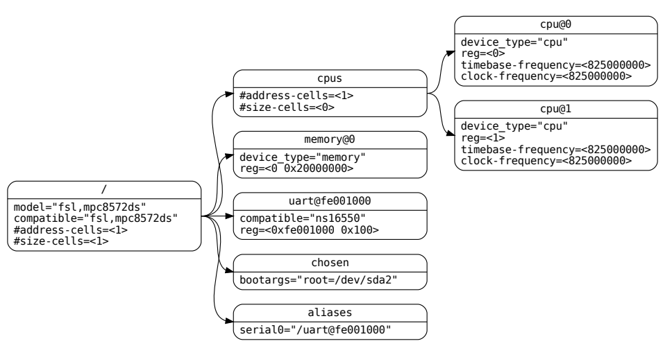

# Device tree

As stated by the [device tree specification][device_tree_pdf], provided by [devicetree.org][device_tree_org]:

"A *devicetree* is a tree data structure with nodes that describe the devices in a system. Each node has property/value pairs that describe the characteristics of the device being represented. Each node has exactly one parent except for the root node, which has no parent."

A device tree (DT) should be OS and project agnostic. It must be correlated to the capabilities of the hardware devices and not its specific configuration. E.g., the device tree lists all the possible modes of a GPIO pin, but not necessarily which mode will be used.

The following image shows a DT that is nearly complete enough to boot a simple operating system, with the platform type, CPU, memory and a single UART described.



We will divide this topic in three sections: First, the general syntax and properties that apply to all nodes. Then, a per-node analysis. Finally, how to compile.

Note: TODO. There is actually another source of truth for device tree, those are the .yaml schemas in the Linux repo in "Documentation/devicetree"

## General syntax

All nodes can be uniquely identified by a full path from the root node `/` (e.g `/node1/node2`).

The C preprocessor can be run before DTS compilation. Therefore, `#include` and `#define` preprocessor directives may be used.

A node has this syntax:

```dts
[label:] node-name[@unit-address] {
    [properties definitions]
    [child nodes]
};
```

Where a `label:` is a reference that can later be used as a phandle `&label`, that is expanded as the full path of that node.

A DTS file must start with the file version and the root node:

```dts
/dts-v1/;
/ {
    [property definitions]
    [child nodes]
};
```

### Standard properties

`compatible = "<manufacturer,model>", "<manufacturer,model>;"`: A list of comma-separated names, which will be matched against a single device driver. They are read from left to right until a match is found.

`model = <manufacturer,model>;`: Specifies the manufacturer's model number of the device. It is just informative.

`phandle = <>`: TODO

`status = "<okay | disabled | reserved | fail | fail-sss>;"`: Indicates the operational status of a device. If not present, the default values is assumed to be "okay".

#### The reg property

The `reg = <addr1 size11 size12 addr2 size21 size22>;`: Defines the addresses and sizes for the register banks of the device.

`#address-cells = <u32>;` defines how many `<u32>` are required to define a single address. E.g., you would require 2 `<u32>` to define a 64 bit address.

The amount of sizes per address in the child's `reg` is defined by the parent's property `#size-cells = <u32>`.

The address's value in `reg` is relative to the parent's address space. If you specify `ranges = <child-base-address parent-base-address length>;`, then any address in the child will be translated as `child-addr + parent-base-address`. The usual usage is `ranges = <0x0 parent-base-address length>`. TODO

### Interrupt property

Interrupts are handled as a separate "interrupt tree", adjacent to the actual device tree.

There are two types of devices:

1. Interrupt controllers.

    `#interrupt-cells = <u32>;`: The amount of fields required to encode an interrupt. For example <1> could mean only the interrupt id, while <2> could imply the interrupt id and the interrupt level.

    `interrupt-controller;`: Defines the node as such.

2. Interrupt generating devices.

    * `interrupt-parent = <&phandle>;`. Points to the interrupt controller parent in the interrupt tree.`

    * `interrupts = <int1>, <int2>;`. Defines the interrupts that are generated by the device. The value of the interrupt property `<int1>` must have the same amount of fields specified by the `interrupt-parent`'s `#interrupt-cells` property.

## Node-specific syntax

### Root node

`serial-number = <string>;`: Devices serial number.

`chassis-type = "<desktop | laptop | convertible | server | tablet | handset | watch | embedded>";`: Form-factor of the system.

E.g.:

```dts
/ {
    #address-cells = <1>;
    #size-cells = <1>;
    model = "cotti,cotti-board";
    compatible = "cotti,cotti-board-driver";
    serial-number = "1234";
    chassis-type = "embedded";
};
```

### /aliases node

A short-hand collection of node's full paths. These aliases string values are replaced E.g:

TODO phandles and how to use alieases

```dts
/aliases {
    serial0 = "/simple-bus@fe000000/serial@llc500";
    ethernet0 = "/simple-bus@fe000000/ethernet@31c000";
};
```

### /memory node

Defines as much memory regions and sizes with the `reg` property as provided by the root node `/` with `#address-cells`.

`device_type = "memory";`. Mandatory property.

`hotpluggable;`: If it is defined, then it is a hint for the OS that this memory might be removed later.

E.g.: defines two memory regions, one at address `0x10000000` of `0x00800000 = 8 MiB`, and the other at `0x80000000` with `0x10000000 = 256 MiB`.

```dts
/ {
    #address-cells = <1>;
    #size-cells = <1>;

    memory@0 {
        device_type = "memory";
        reg = < 0x10000000 0x00800000
                0x80000000 0x10000000>;
    };
};
```

### /chosen node

TODO

### /cpus and /cpus/cpu* nodes

A `/cpus` node is required for all device trees. It is a container for the actual child `cpu` node. It should have a `#address-cells`, a `#size-cells = <0>;`, and any common property shared among child `cpu`.

A `/cpus/cpu*` node, where `*` is the CPU's number, should have:

* `device_type = "cpu"`. Mandatory.
* `reg`:
* `clock-frequency = <u32> | <u32 u32>`: A 32-bit or 64-bit, if a constant value for CPU frequency [Hz] is expected.
* `timebase-frequency = <u32> | <u32 u32>`: A 32-bit or 64-bit that specifies the frequency at which the timebase and decrementer registers are updated [Hz]. This concept is related to system "ticks", where one system tick is independent from the system's clock.
* `status = "okay";`. TODO disabled state
* TODO POWER ISA.
* TODO TLB properties.
* TODO L1 cache properties.

TODO example.

### UART

* `clock-frequency = <u32>;`: [Hz] Frequency of the baud rate generator's input clock.

* `current-speed = <u32>;`: Baudrate. A boot program should set this property if it has initialized the serial device.

TODO National Semiconductor 16450/16550

[device_tree_org]: https://www.devicetree.org/
[device_tree_pdf]: https://github.com/devicetree-org/devicetree-specification/releases/download/v0.4/devicetree-specification-v0.4.pdf
