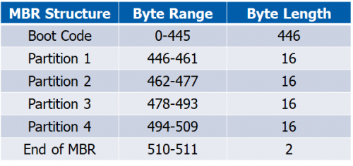
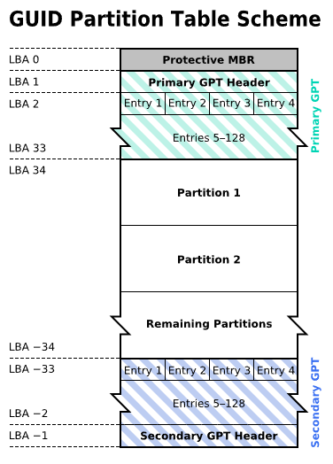
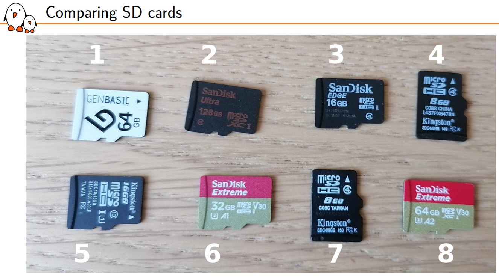
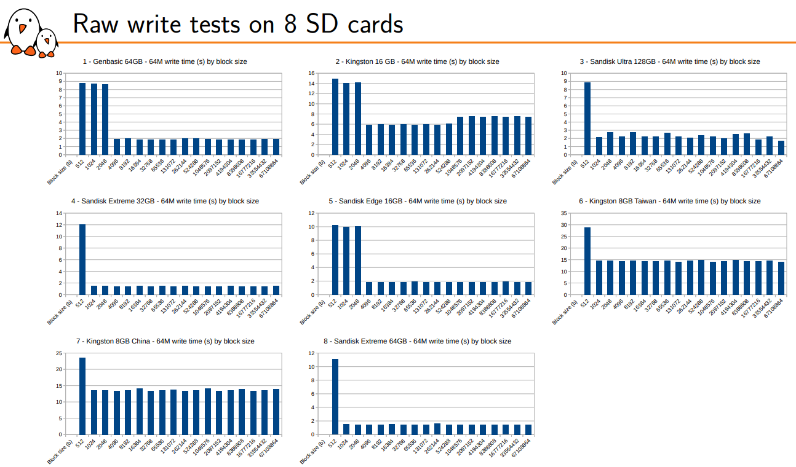
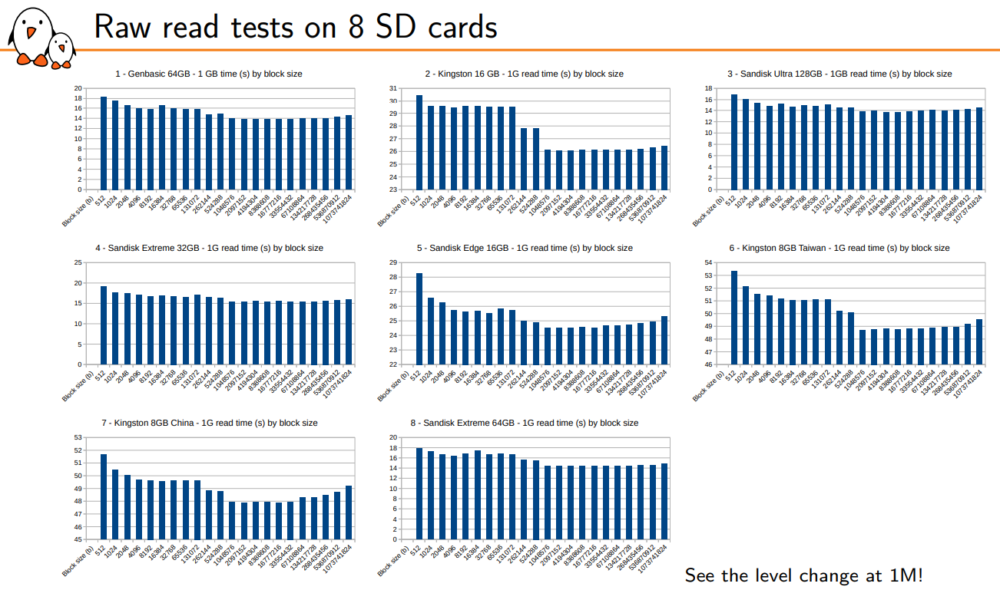
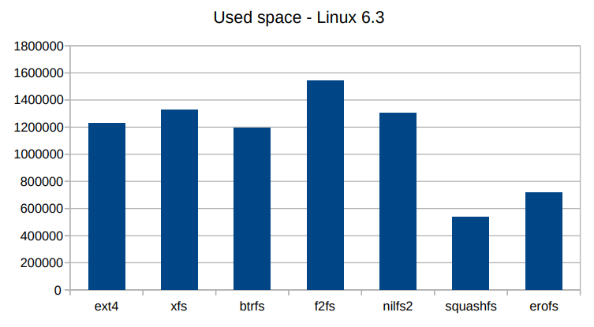
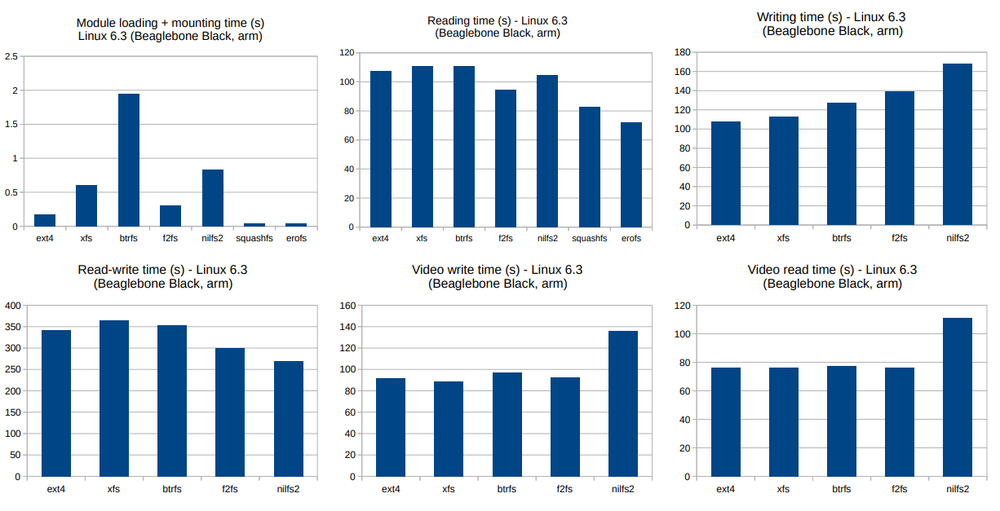
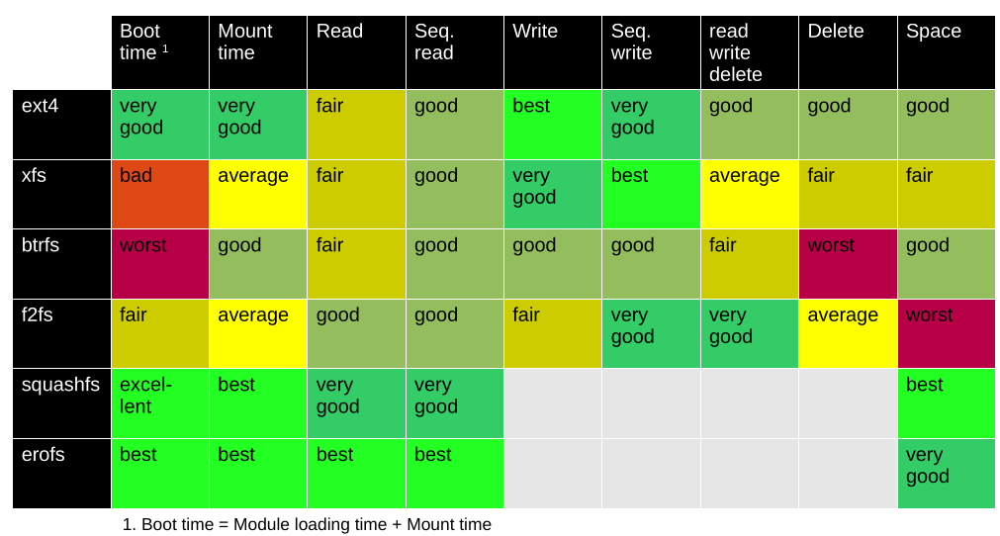
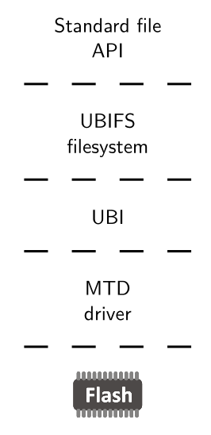
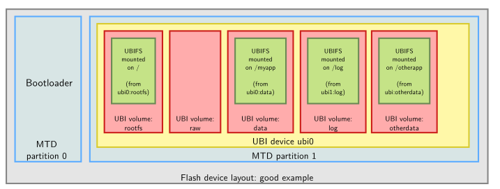

# Filesystems

The usage of filesystems is transparent and always the same no matter the type. However, the filesystem's choice should be tailored to the device where it will be used (RAM, SD Card, USB, NAND Flash, etc), and the requirements of space and read/write timings.

First, we will take a look at [partitions tables][partition_tables_section], i.e., how to prepare a device to hold filesystems in it. Then, we will compare filesystems for block devices and how to create them. Finally, we will review filesystems for RAM, NAND and NOR flashes.

## Partition tables

A partition table can be thought as a book's index. It tells the device's reader three main things:

* Where to find the filesystems.
* The size of the filesystems.
* The type of filesystem.

There are two standards MBR and GPT:

### MBR: Master Boot Record

[Master Boot Record][mbr_wikipedia] (MBR) is the original and simplest. As shown in the image below, it consists of a 512 byte block with an initial boot code, space for four partitions and a footer. Then, it follows the actual partitions' storage.



Properties of MBR:

* Only up to 4 partitions supported.
* Disk size < 2TB.
* Partition table stored only in the first 512 bytes: corruption of this table means loss of the whole drive.
* Simpler to use.

### GPT: GUID Partition Table

The [GUID Partition Table][guid_wikipedia][^1] (GPT) is the newer and better version. It storage strategy is based on Logical Block Addressing (LBA), where 1 LBA == 512 bytes, the usual block size. The image below shows the memory mapping of a GPT partitioned device, where:

* The first LBA is reserved for the legacy MBR: if the reader want's to read or modify the MBR sector, it won't affect the rest of the GPT metadata. By default, the MBR indicates that a single partition of type `0xEE == GPT` occupies the whole drive.
* Then, a header and up to 128 partitions can be defined.
* The space for the actual partitions.
* At the end of the addressable memory space, a copy of the headers and partition tables.



Advantages of GPT:

* Supports up to 128 partitions.
* Header and partition table are duplicated at the start and end of the block device: recoverable in case of corruption.
* Disk size not a problem.
* First block is left as a "protective MBR", so it can be modified by MBR software without trampling over the GPT header.
* Occupies more space and is harder to read.

## Block filesystems

A block device (HD, RAM disks, USBs, SSD, SD, eMMC), can be read and written to on a **per-block basis**, in random order, without erasing. They are usually made up of a NAND flash plus a controller, which hides the details of accessing that NAND flash.

The reading, writing and erasing operations handle this sizes:

1. **Sector size**: Data unit the host reads/writes through the controller (~512 bytes).
2. **Page size**: Unit NAND storage. The NAND can only be read/written in multiples of the page size, as a hardware limitation (~4KiB).
3. **Erase Block size**: Erasable unit of NAND storage. Usually, an erasure can only be done on groups of pages (~32 pages == 128 KiB), and sometimes only on groups of erase blocks called segments (~1MiB), depending on the controller.

In consequence, when you try to write 512 bytes, a smaller length than the page size, the controller internally has to read 4KiB, modify those 512 bytes and rewrite the 4KiB page, which is inefficient compared to just writing 4KiB. This was demonstrated by [a comparison made by Bootlin][bootlin_sd_comparison] where 8 different SD cards were read and written with different block sizes. In all of them, a clear reduction of write time was found around 1KiB and 4KiB (i.e. the page size), while a reduction of read time was found around 1MiB (i.e the erase block size).

These are the reasons why most filesystems usually buffer writes to 4KiB.







Also, the guys at [Bootlin made a comparison of the different filesystems][bootlin_sd_comparison], and two clear winners emerged, as the below images show:

For read/write filesystems, use **ext4**; for read-only use **squashFS**.

The advantages of a read-only filesystem are faster reading times and less space, which makes them ideal for the OS and kernel files, while you can have an ext4 mounted on `/home` for user space applications.







## Creating partitions and filesystems for block devices

Given a new block device, the first thing to do is to erase any trace of an old partition table.

The `dd` (dataset definition) command is very useful to read/write raw block devices. You can write from an input file `if` to an output file[^2] `of` a `count` amount of blocks, with block size `bs` as:

```bash
dd bs=<block_size> count=<amount_of_blocks> if=<input_file> of=<output_file>
dd bs=1M count=1 if=/dev/zero of=/dev/sda
```

For creating partitions, `fdisk` and its ncurses variant `cfdisk` are suggested. If your device doesn't have a partition table, executing `cfdisk` will ask you which type of partition table you want: `dos == MBR` or `gpt`.

Then, you can create the partitions as you like, defining three things:

1. Its size.
2. Its type (usually `c == FAT32`, `83 == Linux (ext4 | squashFS)`).
3. Whether it's bootable or not (usually the bootloader partition is flagged).

After the partitions are created, they will appear as devices such as `/dev/<device_type><device_letter><partition>`, e.g. `/dev/sda1` `/dev/sdb2`. Usually, `\dev\sda` refers to the whole device, and partitions start from number 1.

The assignment of partition's types doesn't mean that the filesystem has been created, but rather that the OS can expect a filesystem to be present in that partition.

To create a read/write filesystem, use the `mkfs.<fs>`[^3] command. Make sure to point to the correct partition.

```bash
mkfs.<fs> [options] <device_partition>
```

After that, filesystems must be mounted to be used, so use the `mount` command, edit the filesystem to make changes, and `umount` it when done.

```bash
lsmount
sudo mount -t vfat <device_partition> <path> [-o uid=$(id -u),gid=$(id -g),umask=$(umask)]
sudo umount <path>
```

Creating a read-only filesystem is different, because you can't write to it. To create a squashFS, you need to convert a directory into a read only image:

```bash
sudo apt install squashfs-tools
mksquashfs <list_of_sources> <fs_name.sqfs> -noappend [options]
```

And then, write the filesystem's image into the block device's partition, using the `dd` command:

```bash
sudo dd if=<fs_name.sqfs> of=<device_partition>
```

Finally, you can check that the filesystem has been correctly uploaded by mounting and seeing the files. You won't be able to modify them, since its a read-only filesystem after all.

```bash
sudo mount -t squashfs <device> <path>
sudo umount <path>
```

## Raw flash filesystem

A raw flash device can be read by block sizes, but writing requires prior erasing and often occurs on a larger size than the "block" size. Also, each page usually has an Out-Of-Band area (OOB) where an ECC (Error Correction Code) is stored, because of the fact that bit flips are more likely.

Also, they are more prone to wear and bad blocks appearing, so erasures have to be distributed evenly (called "wear leveling") to prolong the lifespan of the FLASH.

Linux manages raw flash devices (RAM, ROM, NOR flash, NAND flash, etc) as Memory Technology Devices (MTD).

Because MTDs are prone to have bit errors, the partition tables are stored externally to the device, usually in the device tree or as kernel command line parameters.

Each partition creates a different device `/dev/mtd<X>`, completely separated from the rest.

Nowadays, the de-fact standard is using UBI/UBIFS for the filesystem. UBI (Unsorted Block images) is the wear leveling algorithm, and UBIFS is the filesystem that runs on top. Normally, the way to go is to create MTD partitions for the bootloader and the system, and UBI volumes inside the system's partition.





## Creating a filesystem for raw flash devices

TODO

```bash
sudo apt install mtd-utils
mkfs.ubifs
ubinize
mtdblock
ubiblock
```

<!--Footers-->
[^1]: Globally Unique Identifier (GUID).

[^2]: Remember that in Linux, everything is a file, including the block devices.

[^3]: A variation of the `mkfs.<fs>` exists for most filesystems, such as `mkfs.fat` or `mkfs.ext4`. The flags for each type of filesystem are different, but it is usually a good idea to give them a label at least.

<!--Internal links-->
[partition_tables_section]: #partition-tables

<!--External links-->
[mbr_wikipedia]: https://en.wikipedia.org/wiki/Master_boot_record
[guid_wikipedia]: https://en.wikipedia.org/wiki/GUID_Partition_Table
[bootlin_sd_comparison]: https://bootlin.com/pub/conferences/2023/eoss/opdenacker-finding-best-block-filesystem/opdenacker-finding-best-block-filesystem.pdf
