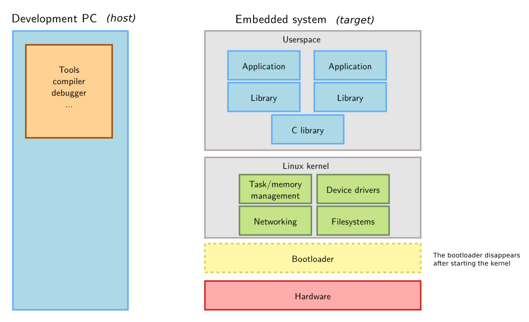

# The embedded Linux ecosystem

The development of an embedded Linux system requires four basic components:

1. A [cross-compilation toolchain][toolchain_section]: A compiler that runs on the development machine and generates code for the target with their respective C-library.
2. A [bootloader][bootloader_section]: Responsible for basic hardware initialization, loading the kernel image and executing it.
3. The [Linux kernel][linux_kernel_section]: Provides system calls to interface with the hardware, device drivers, a network stack and everything required by user-space applications.
4. The target application.

First, we will review how to configure and compile each component separately.
Then, we will take a look at the [Buildroot][buildroot_section] build system.
Finally, Yocto. (TODO YOCTO link).

## References

The following sections have been greatly inspired by [Bootlin's Embedded Linux Training][bootlin_embedded_linux], [Bootlin's Buildroot system development][bootlin_buildroot] and [Bootlin's Yocto Project and OpenEmbedded system development][bootlin_yocto] courses.

Also, [Bootlin's Elixir Cross Referencer][bootlin_elixir] is a great way to navigate the source files of the different open source projects that will be reviewed in this document.

<!--External links-->
[bootlin_embedded_linux]: https://bootlin.com/training/embedded-linux/
[bootlin_buildroot]: https://bootlin.com/training/buildroot/
[bootlin_yocto]: https://bootlin.com/training/yocto/
[bootlin_elixir]: https://elixir.bootlin.com

<!--Internal links-->
[buildroot_section]: /docs/embedded/buildroot/buildroot.md
[toolchain_section]: /docs/embedded/toolchain
[bootloader_section]: /docs/embedded/bootloader_linux
[linux_kernel_section]: /docs/embedded/linux_kernel
