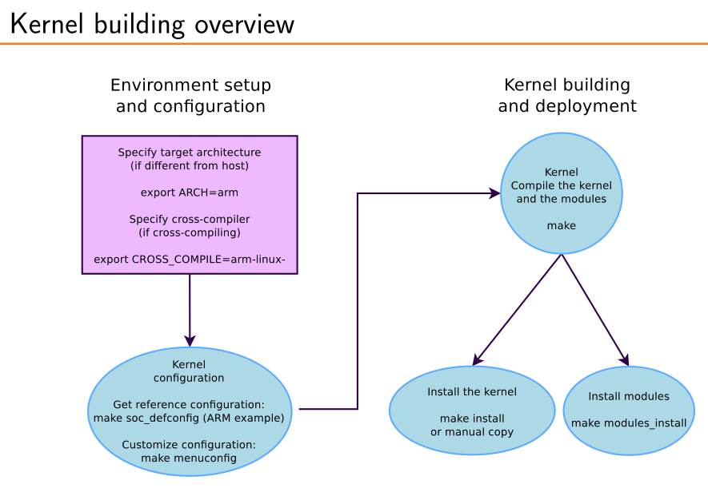

# Linux Kernel

The objective of this section is to understand what it takes to build and boot the Linux kernel.

## Installation

Clone the [oficial mainline Linux Git repo][linux_git], the [oficial stable versions][linux_stable_git], or the [GitHub mirror][linux_github].

Check the current version your are working with:

```bash
make kernelversion
```

Make sure to define in your environment the computer architecture and the cross compiler path. Supported architectures are the names inside the `arch` directory.

```bash
export ARCH=<arch>
export CROSS_COMPILE=<cross_compiler->
```

Search for a default board configuration inside the `arch/<arch>/configs` and load it with:

```bash
make <board_defconfig>
```

Edit config with:

```bash
make nconfig
make savedefconfig
make -j$(nproc)
```

Results stored in:

* `arch/<arch>/boot/Image`: bootable uncompressed kernel image.
* `arch/<arch>/boot/*Image*`: bootable compressed kernel image.
* `arch/<arch>/boot/dts/<vendor>/*.dtb`: device tree blob.



Embedded architectures usually have a lot of non-discoverable hardware (serial, Ethernet, I2C, NAND flash, etc). This hardware needs to be described and passed to the Linux Kernel using device trees. The `.dtb` file will be automatically compiled from the `.dts` and `dtsi` files present in the `arch/<arch>/boot/dts/<vendor>/` directory.

!!! tip
    The device tree blob `.dtb` is not a part of the Linux kernel and does not influence the result of the Linux kernel's compilation. Therefore, you can compile your own `.dtb` and flash it together with the kernel.

!!! tip
    The configuration options in `make nconfig` are quite a lot, but very straight forward. Once you get it to boot, you can start trimming the fat and seeing what actually is truly needed. Your Linux won't stop booting for adding stuff just for the sake of it, but it will not work if one key configuration was not marked.

## Booting the kernel

The generated compressed kernel image, the `zImage` file, and the device tree blob `.dtb` are not enough to boot a Linux OS. You still require a minimal filesystem and some applications.

* The `init` application, located at `/sbin/init`, `/etc/init`, `/bin/init` or `/bin/sh`. It is responsible for starting all other user space applications and services.
* A shell to implement scripts and allow a user to interact with the system.
* Basic UNIX executables for scripts and the shell like `mv`, `cp`, `cat`, `mount`, etc.

## BusyBox

[BusyBox][busybox] is a collection of the essential command line utilities needed to run an embedded Linux.

It is integrated in a single project and in a single executable `/bin/busybox`. All other applications are symbolic links to `/bin/busybox`, with the first argument being the name of the script

### Busybox installation

Get the latest stable source.

```bash
git clone https://git.busybox.net/busybox
cd busybox
git checkout <stable_version>
```

Set default configuration, and modify with menuconfig (doesn't have nconfig):

```bash
make defconfig
make menuconfig
```

Set the path to the cross compiler and compile:

```bash
export CROSS_COMPILE=<path_to_toolchain->
make
```

Install it. By default, all required files go to `./_install`. You should copy and paste this folder into your Linux partition, maybe including and empty `/dev` folder if not present.

```bash
make install
```

<!--External links-->
[linux_git]: https://git.kernel.org/pub/scm/linux/kernel/git/torvalds/linux.git
[linux_stable_git]: https://git.kernel.org/pub/scm/linux/kernel/git/stable/linux.git
[linux_github]: https://github.com/torvalds/linux
[busybox]: https://www.busybox.net/
