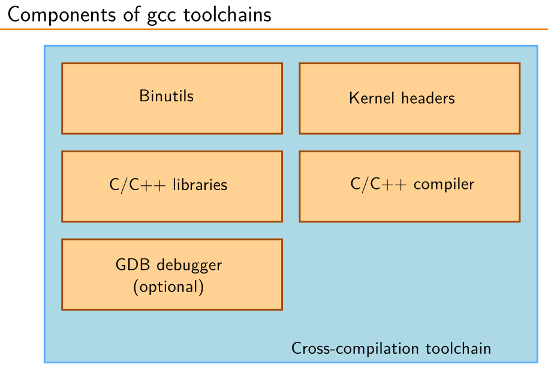
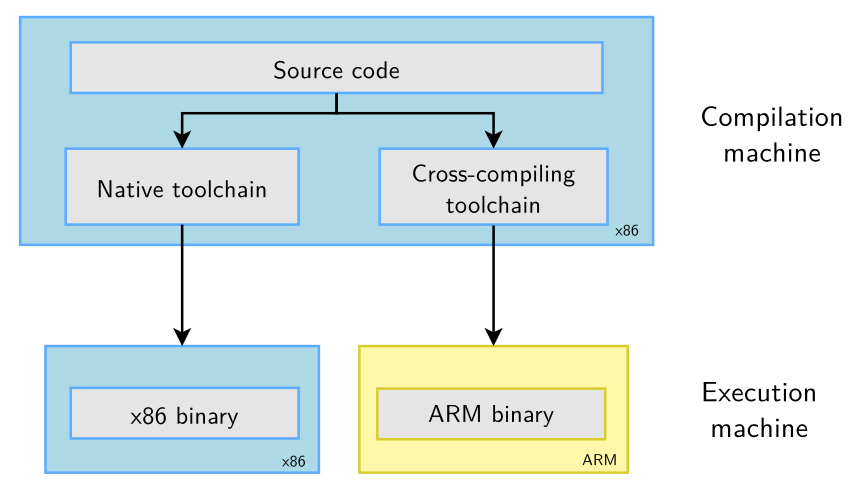

# Toolchain introduction

A toolchain is defined as the set of tools required to produce a software. In the context of embedded development, a toolchain is composed of:

* [Binutils][binutils_section]: a set of tools to generate and manipulate binaries (usually with the ELF format) for a given CPU architecture. They include tools such as the assembler `as`, the linker `ld`, between others.
* Kernel headers: they define the way in which the application code interacts with the underlying OS.
* C/C++ libraries: musl, glibc, newlib, picolibc, etc.
* C/C++ compiler: normally `gcc`, althoug LLVM `clang` is rising in popularity.
* GDB debugger.



A toolchain is identified by a **tuple** like:

```txt
<arch>-<OS>-<ABI>
<arch>-<vendor>-<OS>-<ABI>
```

Where:

* Arch: CPu architecture (`arm`, `riscv`).
* Vendor: Free-form vendor name.
* OS: Operating system name (`linux`, `none`).
* ABI: Application Binary Interface (`gnueabihf`, `eabi`).

## Introduction to cross compilation

Cross-compilation is defined as the process of generating binary files from a **host** CPU architecture to a **target** hardware with a different CPU architecture.



There are three approaches to getting a cross-compilation toolchain:

1. Getting a pre-compiled toolchain, such as the [Bootlin's toolchains][bootlin_toolchains] or [Linaro's toolchains][linaro_toolchains]. This is the simplest and most convenient solution, but you can't fine tune the toolchain to your needs.

2. Building the toolchain as a part of a build system, such as [Buildroot][buildroot] or [Yocto Project][yocto].

3. Using [Crosstool-NG][crosstool], which lets you customize the toolchain to your liking. This approach will be reviewed in the remainder of this article.

In the remaining of this article we will review this last tool.

## Crosstool-NG

[Crosstool-NG][crosstool] purpose is to build toolchains. Nothing more, nothing less. It is quite straightforward to install and use, provided that you know what you need and what you are doing. [Crosstool-NG's documentation][crosstool_docs] is short and sweet, so I suggest to consult it in doubt, but here is is a short summary:

The local installation commands are as follow:

```bash
VERSION="1.28.0"
wget "http://crosstool-ng.org/download/crosstool-ng/crosstool-ng-${VERSION}.tar.bz2"
tar -xf "crosstool-ng-${VERSION}.tar.bz2"
cd "crosstool-ng-${VERSION}"

sudo apt update && sudo apt install -y \
    gcc g++ gperf bison flex texinfo help2man make libncurses-dev \
    python3-dev autoconf automake libtool libtool-bin gawk wget bzip2 \
    xz-utils unzip patch libstdc++6 rsync git meson ninja-build

./configure --enable-local
make
cat ./bash-completion/ct-ng >> "${HOME}/.bashrc"
```

The best way to configure a toolchain is to select the configuration for a similar architecture and then tune it from there. The list of available toolchains can be seen with:

```bash
./ct-ng list-samples
```

Then, the details of a toolchain can be seen with the `show-<tuple>` command. The special `show-config` parses the current `.config` file to show the details of the current toolchain's configuration.

```bash
./ct-ng show-<tuple | config>

./ct-ng show-arm-none-eabi
[L...]   arm-none-eabi
    Languages       : C,C++
    OS              : bare-metal
    Binutils        : binutils-2.45
    Compiler        : gcc-15.2.0
    Linkers         :
    C library       : newlib-4.5.0.20241231 picolibc-1.8.10
    Debug tools     :
    Companion libs  : gmp-6.3.0 isl-0.27 mpc-1.3.1 newlib-nano-4.5.0.20241231
    Companion tools :
```

Next, load the default toolchain's configuration into the `.config` file with:

```bash
./ct-ng <tuple>
```

After that, make configurations in the GUI menu with `nconfig` or `menuconfig`:

```bash
./ct-ng nconfig
```

Finally, after the configuration is to your liking, start build the toolchain with,

```bash
./ct-ng show-config
./ct-ng build
```

There are two different kinds of toolchains, each with different requirements:

* [Bare-metal toolchains][baremetal_toolchain]: For devices without an OS, or maybe a simple RTOS.
* [Embedded Linux toolchains][linux_toolchain]: For devices with the Linux OS.

<!--External links -->
[bootlin_toolchains]: https://toolchains.bootlin.com/
[linaro_toolchains]: https://www.linaro.org/downloads
[yocto]: https://www.yoctoproject.org/
[buildroot]: https://buildroot.org
[crosstool]: https://crosstool-ng.github.io/
[crosstool_docs]: https://crosstool-ng.github.io/docs/

<!--Internal links-->
[binutils_section]: /docs/arm_assembly/binutils
[baremetal_toolchain]: /docs/embedded/toolchain_baremetal
[linux_toolchain]: /docs/embedded/toolchain_linux
