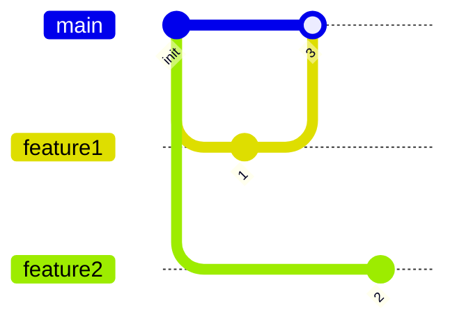
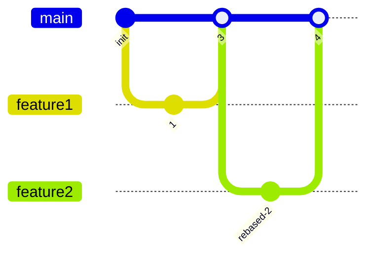

# Git best practices

## Conventional commits

[Conventional commits][conventional_commits] is somewhat like a standard on how to write commit messages. Basically, a commit message must be structured as follows:

```txt
<type>[optional scope]: <description>

[optional body]

[optional footer(s)]
```

Where:

* `<type>`: `fix`, `feat`, `docs`, `ci`, etc.
* `<description>`: "verb (in lowercase and infinitive)" + "action done"

## Trunk-Based development

[Trunk-Based Development][trunk] is the best branching strategy for Git.

The idea is that the `main` branch should always hold a stable version. For every new feature or fix, a new short-lived branch should be created. Each developer works in his branch and, when he finishes, opens a pull request to the `main` branch.

This pull request serves two purposes:

* For peer reviewing.
* To trigger the CI runners.

If both conditions are satisfied, then the development branch can be merged to `main` and later deleted.

Both diagrams below show how to do trunk-based development. The branches `feature1` and `feature2` are created from the latest version of `main`. Then, `feature1` is completed and merged to `main`. However, now `feature2` is based on an old version of the `main` branch and it can't perform a fast-forward merge. In consequence, the solution is shown in the second graph, where a rebase is made from `main` before merging.





## Semantic versioning

[Semantic Versioning][semver] gives a meaning to the release numbers. Cited from its page:

!!! quote
    <!-- markdownlint-disable MD046 -->
    Given a version number MAJOR.MINOR.PATCH, increment the:

    1. MAJOR version when you make incompatible API changes
    2. MINOR version when you add functionality in a backward compatible manner
    3. PATCH version when you make backward compatible bug fixes

<!-- External links -->
[semver]: https://semver.org/
[trunk]: https://trunkbaseddevelopment.com/
[conventional_commits]: https://www.conventionalcommits.org/en/v1.0.0/
