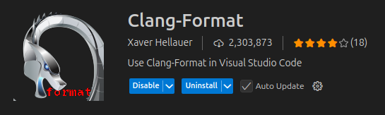

# C linters

There isn't really "linting" when it comes to compiled languages.  They are called static code analyzers, and we will use two: [cppcheck][cppcheck] and [clang-tidy][clang_tidy]

For formatting, we will use [clang-format][clang_format].

These tools need to be installed by:

```bash
sudo apt install clang-format cppcheck clang-tidy
```

clangd


## Command line integration

The static code analyzers can only be run from the command line.

### Clang Format CLI

The best way to learn about the options and usage is to just call `clang-format --help` and read the commands.

To format files:

```bash
clang-format -i --verbose \
    $(find . -path ./**build -prune \
    -o -path ./venv -prune \
    -o -name *.c -print \
    -o -name *.h -print \
    -o -name *.cpp -print)
```

To check for errors in style:

```bash
clang-format --dry-run --Werror --verbose \
    $(find . -path ./**build -prune \
    -o -path ./venv -prune \
    -o -name *.c -print \
    -o -name *.h -print \
    -o -name *.cpp -print)
```

!!! note
    Since `clang-format` does not support shell expansion for files, we use the `find` command to search for all `.c`, `.cpp` and `.h` files, excluding the ones found in any `build` directory or the python `venv`.

You can customize your own style options by creating a `.clang-format` file in the root of the repository, as specified in the [Clang-Format Style Options][clang_format_style].

Down below the recommended `.clang-format` file to be used is shown: you base your style on one of the predefined ones, and then tweak as you like.

```yaml
BasedOnStyle:  LLVM
IndentWidth: 4
```

To get the full style configuration from one of the main references, you can execute:

```bash
clang-format -style=llvm -dump-config > .clang-format
```

### Clang Tidy CLI

### CppCheck CLI

The best way to learn about cppcheck is to just execute `cppcheck` and see all the command line options.

The recommended execution command is as follows:

```bash
cppcheck --cppcheck-build-dir=<build/cppcheck> --check-level=<normal | exhaustive> --enable=all --disable=information --error-exitcode=1 -I <header_dir> .
```

Where:

* `--cppcheck-build-dir`: By specifying a build dir, cppcheck stores artifacts for faster re-runs. This flag shouldn't be used in a CI runner.
* `--check-level=<normal | exhaustive>`: Use "normal" for everyday, use "exhaustive" for CI.
* `--enable=all`: Enable all checks.
* `--disable=information`: Disable the "information check", which reports about cppcheck usage, not the code.
* `--error-exitcode=1`: If any error is reported by cppcheck, return this exit code (by default, cppcheck always returns '0').
* `-I`: Include header directories.
* `.`: Will check from this path recursively all C source files.

For any more details, go check the [Cppcheck manual][cppcheck_manual].

## VS Code integration

Only the formatter can be integrated, since the static code analyzers need to be run specifically from the command line.



After installing the [clang-format VS Code extension][clang_format_extension], add the following to the `.vscode/settings.json` file:

```json
{
    "files.autoSave": "onFocusChange",
    "editor.formatOnSave": true,
    "editor.formatOnPaste": true,
    "editor.formatOnSaveMode": "file",
    "clang-format.style": "file",
    "clang-format.fallbackStyle": "LLVM",
    "[c]": {
        "editor.defaultFormatter": "xaver.clang-format"
    },
    "[cpp]": {
        "editor.defaultFormatter": "xaver.clang-format"
    },
}
```

The extension is going to search for a `.clang-format` file in the root of the folder you have open with VS Code. If it doesn't find it, it will use the LLVM style by default.

## CI integration

Normally, these tools are included in your compilation environment, so calling the formatter and static code analyzers are steps included in the build CI. Just for completeness, this is how a CI would look like:

```
```

<!-- External links -->
[clang_format]: https://clang.llvm.org/docs/ClangFormat.html
[clang_format_extension]: https://marketplace.visualstudio.com/items?itemName=xaver.clang-format
[clang_format_style]: https://clang.llvm.org/docs/ClangFormatStyleOptions.html
[clang_tidy]: <https://clang.llvm.org/extra/clang-tidy/>
[cppcheck]: <https://www.cppcheck.com/>
[cppcheck_manual]: <https://cppcheck.sourceforge.io/manual.html>
