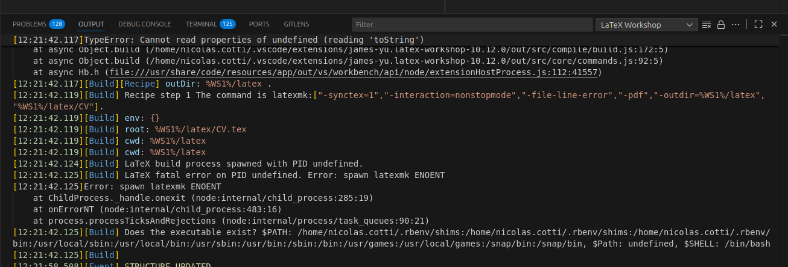

# Latex

In this guide we will see how to setup a Latex environment to work with VSCode, and some troubleshooting.

## Installation

First, install the VS Code extension:


You can see the latex compiler output in VSCode in the console menu within "OUTPUT->LaTeX Workshop"

You MUST install TeX Live to compile Latex. Follow the instructions in the texlive page.

<https://www.tug.org/texlive/>

<https://www.tug.org/texlive/quickinstall.html>

WARNING: This installation may take several hours.



After the installation is finished, remember to add the installation path to your PATH variable:

```bash
cd /tmp
wget https://mirror.ctan.org/systems/texlive/tlnet/install-tl-unx.tar.gz
zcat < install-tl-unx.tar.gz | tar xf -
cd install-tl-2*
sudo perl ./install-tl --no-interaction
echo "export PATH=\"/usr/local/texlive/$(date +%Y)/bin/$(uname -m)-$(uname -s | tr [:upper:] [:lower:]):\${PATH}\"" >> ~/.bashrc
```

```bash
/usr/local/texlive/$(date +%Y)/bin/$(uname -m)-$(uname -s | tr [:upper:] [:lower:])
```

## Usage

```json
{
    "files.autoSave": "onFocusChange",

    "[latex]": {
        "editor.wordWrap": "wordWrapColumn",
        "editor.wordWrapColumn": 80,
    },
    "latex-workshop.latex.outDir": "build",
    "latex-workshop.latex.magic.args": [
        "-output-directory=build", // to change the output directory
        "%DOC%",
    ],
}
```

## Troubleshoot

Recipe terminated with fatal error: spawn latexmk ENOENT.

This error happens because you didn't install Latex.
