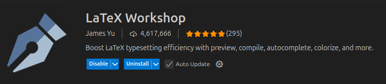
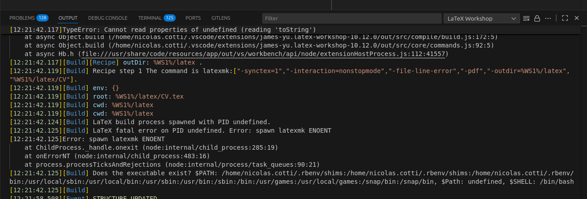

# Latex

In this guide we will see how to setup a Latex environment to work with VSCode, and some troubleshooting.

## Installation

First, install the VS Code extension:



You can see the latex compiler output in VSCode in the console menu within "OUTPUT->LaTeX Workshop"

You MUST install TeX Live to compile Latex. Follow the instructions in the texlive page.

<https://www.tug.org/texlive/>

<https://www.tug.org/texlive/quickinstall.html>

WARNING: This installation may take several hours.



After the installation is finished, remember to add the installation path to your PATH variable:

```bash
cd /tmp
wget https://mirror.ctan.org/systems/texlive/tlnet/install-tl-unx.tar.gz
zcat < install-tl-unx.tar.gz | tar xf -
cd install-tl-2*
sudo perl ./install-tl --no-interaction
echo "export PATH=\"/usr/local/texlive/$(date +%Y)/bin/$(uname -m)-$(uname -s | tr [:upper:] [:lower:]):\${PATH}\"" >> ~/.bashrc
```

```bash
/usr/local/texlive/$(date +%Y)/bin/$(uname -m)-$(uname -s | tr [:upper:] [:lower:])
```

## Usage

Add this to your `.vscode/settings.json` file:

```json
{
    "files.autoSave": "onFocusChange",

    "[latex]": {
        "editor.wordWrap": "wordWrapColumn",
        "editor.wordWrapColumn": 80,
    },
    "latex-workshop.latex.outDir": "build",
    "latex-workshop.latex.magic.args": [
        "-output-directory=build", // to change the output directory
        "%DOC%",
    ],
    "latex-workshop.formatting.latex": "latexindent",
}
```

The extension autodetects the "root" file as the file which has the `\documentclass{}` attribute set. You may have multiple root files, and the one left open in the VSCode tabs is the one compiled:

```tex
\documentclass{article}

\begin{document}

Hello World!

\end{document}
```

## Templates

You may find [IEEE templates][ieee_templates]. This repo includes a copy of the IEEE Journals and Transactions template compiled.

The only difference being that it was modified to use BibTex.

## Troubleshoot

* Recipe terminated with fatal error: spawn latexmk ENOENT.

This error happens because you didn't install Latex.

* PDF file is created, but can't be visualized from VSCode Tab, but only from browser or OS PDF viewer.

    Probably need to update VSCode:

    ```bash
    sudo apt update && sudo apt install --only-upgrade code
    ```

* Following errors when enabling the formatter:

    * stderr: Can't locate YAML/Tiny.pm
    * stderr: Can't locate File/HomeDir.pm in @INC (you may need to install the File::HomeDir module)

    ```bash
    sudo apt install libyaml-tiny-perl libfile-homedir-perl libxml-simple-perl
    sudo cpan -i File::HomeDir
    ```

<!--External links-->
[ieee_templates]: https://journals.ieeeauthorcenter.ieee.org/create-your-ieee-journal-article/authoring-tools-and-templates/tools-for-ieee-authors/ieee-article-templates/
