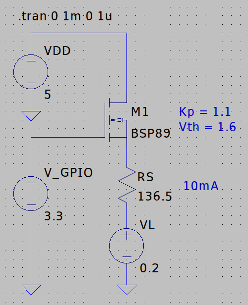

# Common electrical circuits

In this section I will describe some common electrical circuits and mathematical formulas involved.

Before starting, I will say this only once: MOSFET > BJT.

BJT are easier to use, but:

* Require a base current to operate, making the IC consume more power.
* Have lower switching speeds, therefore consuming more power.
* Have lower maximum current thresholds.

Ready, I said it. Moving on...

## TODO

[Digilent Pmod Interface Specification](https://digilent.com/reference/pmod/start)

## Choosing MOSFETs

Discrete MOSFET's parameters are seldom given as an exact number, but rather as a range, or must deduced from a poor quality graph.

My personal recommendation for the parameters is to get the typical values at 25°C, and do the worst case and best case calculations, and see if both cases can be tolerated.

Let's look at a real example.

## GPIO drivers

A GPIO driver utilizes a transistor to drive a load using the power from an external source, instead of the power from the GPIO pin. We will make the distinction between the polarity of the GPIO pin:

* **Positive GPIO driver**: the load is energized when the GPIO pin is electrically "HIGH".
* **Negative GPIO driver**: the load is energized when the GPIO pin is electrically "LOW".

### Positive GPIO driver

Let it be a circuit as the one shown below: with the GPIO pin connected to the gate of an NMOS transistor. The load is composed of a bias resistor and a voltage source, a typical LED driver.

The objective is to choose $R_S$ such as there is a desired drain current $I_D$ through the load. Starting from the drain current equation for a saturated MOSFET:

$$I_D = \frac{1}{2} \cdot k_p \cdot (V_{GS} - V_{TH})^2$$

Let it be: $V_{GS} = V_{GPIO} - I_D \cdot R_S - V_L$. Replacing...

$$I_D = \frac{1}{2} \cdot k_p \cdot (V_{GPIO} - I_D \cdot R_S - V_L - V_{TH})^2$$

By rearranging that expression, one gets:

$$R_S = \frac{V_{GPIO} - V_L - V_{TH} - \sqrt{\frac{I_D \cdot 2}{k_p}}}{I_D}$$

Both conditions for cutoff and saturation should be checked. For this configuration, the device is always saturated, assuming the worst case scenario, where $V_{DD} = V_{GPIO}$:

$$V_{DS} > V_{OV}$$

$$V_{DD} - V_S > V_{DD} - V_S - V_{TH}$$

$$ 0 > - V_{TH}$$

Which is always true. For cutoff:

$$ V_{OV} > 0 $$

$$ V_{GS} - V_{TH} > 0 $$

$$ V_{GPIO} - I_D \cdot R_S - V_L - V_{TH} > 0 $$

By using a PMOS at the output and an NMOS to invert the input, you can use $V_{DD}$ instead of $V_{GPIO}$ in the current equation and the cutoff inequation, in the case that the latter is not met.

The value of the $R_1$ resistor must be as high as possible, but at least an order of magnitude less than the $M2$ cutoff resistance $R_{Doff}$. Otherwise, the actual tension at the gate of M1 will be given by a resistor divider, not the source.

### Negative GPIO driver

By using a PMOS instead of an NMOS, you can drive the load with a $V_{GPIO}=0V$.

This driver already uses $V_{DD}$ as the source, but you may want to use exclusively NMOS, as shown below:

