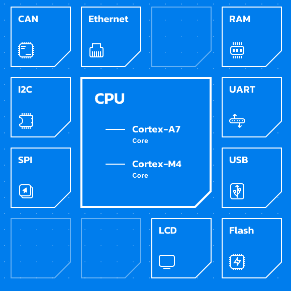

# Renode

[Renode][renode] is a system emulator that lets you assemble virtual System on Chips (SoCs) from building blocks.



A Renode simulation consists of two main parts:

* The [Renode platform][renode_platform_section] (`.repl`): the hardware description.
* The [Renode script][renode_script_section] `.resc`: the instructions that control and launch the simulation.

TODO: revision of scripting.

## Debugging with GDB

Add this as the last line of your `.resc` file. Do NOT start the simulation.

```resc
machine StartGdbServer 3333
```

Connect through GDB, and type:

```gdb
(gdb) target remote localhost:3333
(gdb) lay regs
(gdb) b main
(gdb) continue
```

gdb-multiarch -x "sup/debug_renode.gdb" "build/exe.elf"

## Connecting to an UART

```resc
showAnalyzer usart1
```

<!--External links-->
[renode]: https://renode.io/

<!--Internal links-->
[renode_platform_section]: /docs/simulators/renode_platform
[renode_script_section]: /docs/simulators/renode_script
