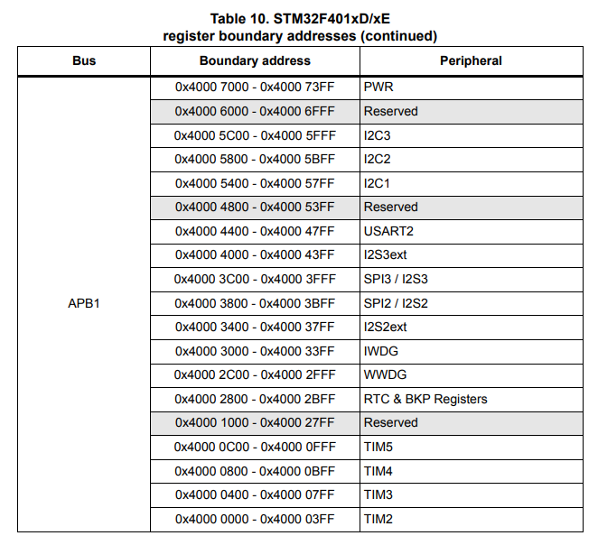

# Steps taken to create example

Created an empty repo for the manifest repo.

Added a simple `west.yml` manifest that includes zephyr, cmsis and stm32_hal and pushed to remote.

Created a python venv and installed west and its dependencies:

```bash
mkdir -p west_ws && cd west_ws
python3 -m venv .venv
source .venv/bin/activate
pip install west
```

Created a new west workspace, using this repo as the manifest:

```bash
west init -m git@github.com:ncotti/zephyr_test.git --mr main
west update

# Note these commands are part of the installation, but are custom west commands provided by the zephyr project
west zephyr-export
west packages pip --install
```

Then, populated the manifest repo with the bare minimum: a hello world C source in  `src/main.c`.

```c
#include <stdio.h>
#include "stm32f4xx_hal.h"

int main(void) {
    while(1) {
        printf("Hello world\n");
        HAL_Delay(1000);
    }
    return 0;
}
```

An empty `prj.conf`.

A CMakeLists.txt with the following:

```cmake
cmake_minimum_required(VERSION 3.20.0)

set(BOARD nucleo_f401re)

find_package(Zephyr)
project(cotti_app)

target_sources(app PRIVATE src/main.c)
```

Running with

```bash
west flash
picocom -b 115200 /dev/ttyACM0
```

## Explaining what's going on

A lot of things had to happen in the background for us to print for a serial console.

Under the hood Zephyr:

* Cross-compiled the application, using some toolchain.
* Defined syscalls for the C-library (write, read, sbrk).
* Configured the UART for us.

The idea is to desmistify Zephyr, since we already know all the things that are done under the hood for us.

## Toolchain

Zephyr provides its own cross-compilation toolchains under the [Zephyr SDK][zephyr_sdk] (Software Development Kit). It is frowned upon changing this SDK, since the features included in the toolchain were thought to compile the Zephyr OS, rather than your particular application.

What can be said of this SDK is that uses Picolibc as its C-library.

## Configuration

All the configuration options regarding the kernel can be found in Menuconfig (there is no nconfig). This is not the traditional menuconfig, but rather a Python look-alike implementation.

The first time this command is run, it will look for the default project configuration in the file `proj.conf`, and will append any configurations explicitily stated in the CMake as `set(CONF_FILE "<absolute_path_to_defconfig>")`, before the Zephyr package is imported.

```bash
west build -t menuconfig
```

Current project configuration is saved in `build/zephyr/.conf`.

After all configuration has been selected, you can press the "D" key to save a `build/zephyr/kconfig/defconfig`, and then copy its contents to the `proj.conf` file.

You can write your own `Kconfig`. The only requirement is to include the Zephyr Kconfig file, `Kconfig.zephyr`, which is located in the Zephyr repo as follows. The location of the Zephyr Kconfig menu is irrelevant (could be placed inside a menu for example), but must be present.

```kconfig
source "Kconfig.zephyr"
```

## Owning the hardware: device tree configuration

So far, we have added in the CMakeLists.txt `set(BOARD nucleo_f401re)`, or run `west build -b nucleo_f401re`.

Picocom works, it prints to the UART. Now, we need to check where is this hardware defined, where is the driver and where is the link to the C library.

The final objective is to change the baudrate of the UART, just to do something.

When you set the environmental variable `BOARD`, it looks for `${BOARD}.dts` files in the following paths:

* In the Zephyr `zephyr/boards/<vendor>/${BOARD}/${BOARD}.dts`. Include paths are relative to `zephyr/dts/<ARCH>/`, e.g. `#include <st/f4/stm32f401Xe.dtsi>`; and bindings can be found at `zephyr/dts/bindings`.

* In your own application, under `boards/<vendor>/${BOARD}/${BOARD}.dts`

Let's start by the datasheet and schematic.

In Section 7.10: USART communication of the [STM32 Nucleo-64 boards User manual][nucleo_board_user_manual], it is mentioned that:

"The USART2 interface available on PA2 and PA3 of the STM32 microcontroller can be connected to ST-LINK MCU [...]". Also, PA2 == TX and PA3 == RX.

Then, in [stm32f401re datasheet][stm32f401re_datasheet] we see that the USART2 is connected to address `0x4000_4400`.



If we trace all the `.dtsi` and the overlay in the `.dts`, we find that the UART has the following configuration:

```dt
// Base SoC device tree "stm32f4.dtsi"
usart2: serial@40004400 {
    compatible = "st,stm32-usart", "st,stm32-uart";
    reg = <0x40004400 0x400>;
    clocks = <&rcc STM32_CLOCK(APB1, 17)>;
    resets = <&rctl STM32_RESET(APB1, 17)>;
    interrupts = <38 0>;
    status = "disabled";
};
```

```dt
// Board-specific overlay "nucleo_f401re.dts"
&usart2 {
    pinctrl-0 = <&usart2_tx_pa2 &usart2_rx_pa3>;
    pinctrl-names = "default";
    current-speed = <115200>;
    status = "okay";
};
```

And then, we can see that this usart is being "chosen" as the zephyr,console and zephyr,shell-uart, which would explain why printf() works:

```dt
chosen {
    zephyr,console = &usart2;
    zephyr,shell-uart = &usart2;
    zephyr,sram = &sram0;
    zephyr,flash = &flash0;
    zephyr,code-partition = &slot0_partition;
};
```

The driver can be found at `zephyr/drivers/serial/uart_stm32.c`, there isn't much to say about it.

## Defining your own board

<https://docs.zephyrproject.org/latest/hardware/porting/board_porting.html#board-porting-guide>

Your board must be based on a supported SoC. You can check the [list of supported SoCs][list_of_supported_socs].

Your board should be placed inside your manifest repo under `board/<VENDOR>/board_name` adn should have the following files:

```bash
boards/<VENDOR>/<BOARD_NAME>
├── board.yml
├── board.cmake
├── CMakeLists.txt
├── Kconfig
├── Kconfig.<BOARD_NAME>
├── <BOARD_NAME>_defconfig
├── <BOARD_NAME>.dts
└── <BOARD_NAME>.yaml
```

The `board.yml` is a high-level description of the board. It is just informative.

```yaml
# File is located in boards/<VENDOR>/<BOARD_NAME>/board.yml
board:
    name: <BOARD_NAME>
    full_name: <Qualitative free-form name>
    vendor: <VENDOR>
    socs:
        - name: <soc_name>

```

The `<BOARD_NAME>.dts` is the device tree of your board. Normally, it would lo like this:

```dt
/dts-v1/;
#include <your_soc_vendor/your_soc.dtsi>

/ {
        model = "A human readable name";
        compatible = "<VENDOR>,<BOARD_NAME>";

        chosen {
                zephyr,console = &your_uart_console;
                zephyr,sram = &your_memory_node;
                /* other chosen settings  for your hardware */
        };

        /*
         * Your board-specific hardware: buttons, LEDs, sensors, etc.
         */

        leds {
                compatible = "gpio-leds";
                led0: led_0 {
                        gpios = < /* GPIO your LED is hooked up to */ >;
                        label = "LED 0";
                };
                /* ... other LEDs ... */
        };

        buttons {
                compatible = "gpio-keys";
                /* ... your button definitions ... */
        };

        /* These aliases are provided for compatibility with samples */
        aliases {
                led0 = &led0; /* now you support the blinky sample! */
                /* other aliases go here */
        };
};

&some_peripheral_you_want_to_enable { /* like a GPIO or SPI controller */
        status = "okay";
};

&another_peripheral_you_want {
        status = "okay";
};
```

The file `Kconfig.<BOARD_NAME>` is mandatory, and should only have a configuration option that selects the SOC the board uses.

```kconfig
config BOARD_<BOARD_NAME>
    select SOC_<SOC_NAME>
```

The file `Kconfig` is automatically included in Zephyr's menuconfig, under "Board Options". Defines board-specific configurations.

Zephyr allows you to define default configuration of your board in two different files: `Kconfig.defconfig` or `<board_name>_defconfig`. The first being a KConfig file, and the latter being the raw CONFIG variables. The advantage of using a `Kconfig.defconfig` over just the variables is that you can leverage conditionals from Kconfig syntax. When setting default values, it is strongly encouraged to just use the `_defconfig` file.

The file `board.cmake` defines how the code will be debugged and flashed with `west flash` and `west debug`.

You need to add only two things in this cmake file:

* Command line arguments
* Include the runner.

```cmake
board_runner_args(stm32cubeprogrammer "--port=swd" "--reset-mode=hw")
board_runner_args(jlink "--device=STM32F401RE" "--speed=4000")

# keep first
include(${ZEPHYR_BASE}/boards/common/stm32cubeprogrammer.board.cmake)
include(${ZEPHYR_BASE}/boards/common/openocd-stm32.board.cmake)
include(${ZEPHYR_BASE}/boards/common/jlink.board.cmake)
```

The `board_runner_args` are not the literal command line arguments for this programs, but rather special arguments required for a Python wrapper built by Zephyr. You can check the possible command line arguments and runners with `west flash --context`.

The file `CMakelists.txt` is only required if your board includes some kind of header file or source file. It should normally not be the case.

The file `<BOARD_NAME>.yaml` is used by twister test runner. TODO

## TODO

```dt
&pinctrl {
    /omit-if-no-ref/ usart2_tx_pa2: usart2_tx_pa2 {
        pinmux = <STM32_PINMUX('A', 2, AF7)>;
        bias-pull-up;
    };

    /omit-if-no-ref/ usart2_rx_pa3: usart2_rx_pa3 {
        pinmux = <STM32_PINMUX('A', 3, AF7)>;
    }
}
```

```dt
pinctrl: pin-controller@40020000 {
    compatible = "st,stm32-pinctrl";
    #address-cells = <1>;
    #size-cells = <1>;
    reg = <0x40020000 0x2000>;

    gpioa: gpio@40020000 {
        compatible = "st,stm32-gpio";
        gpio-controller;
        #gpio-cells = <2>;
        reg = <0x40020000 0x400>;
        clocks = <&rcc STM32_CLOCK(AHB1, 0)>;
    };
};
```

<!--External links-->

[zephyr_sdk]: https://docs.zephyrproject.org/latest/develop/toolchains/zephyr_sdk.html

[stm32f401re_datasheet]: https://www.st.com/resource/en/datasheet/stm32f401re.pdf

[nucleo_board_user_manual]: https://www.st.com/resource/en/user_manual/um1724-stm32-nucleo64-boards-mb1136-stmicroelectronics.pdf

[list_of_supported_socs]: https://docs.zephyrproject.org/latest/boards/index.html#boards
