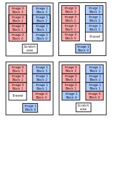
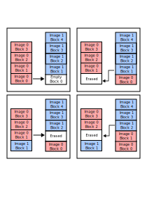
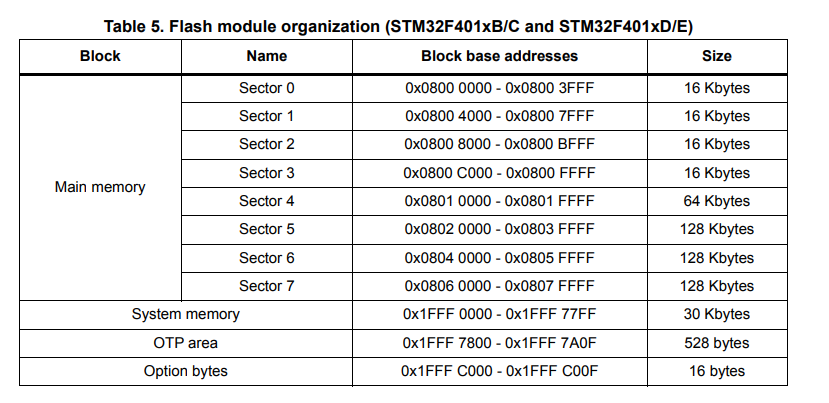

# MCUboot

[MCUboot][mcuboot] is the bootloader used by Zephyr. It only has one feature really: to enable Over The Air (OTA) updates.

To do so, it stores multiple firmware images in the flash memory, detects updates, and chooses which image to boot from.

## Flash vs RAM or XiP execution for MCUs

For a fully fledged embedded Linux system, the normal boot process implies moving the code from a slower non-volatile storage (HDD, Flash, eMMC) to the faster RAM (usually an external DDR interface).

However, MCUs usually have internal Flash and SRAM memories, and the preferred strategy is to execute the code directly from flash, and reserve the SRAM for the stack, variables and critical time-sensitive application code (like interrupt handlers or compute-intensive tasks). Although it is slower to read code from the flash, because it is a block device, the reason is because the Flash is usually larger than the SRAM, as shown in the following comparison table:

| MCU           | Flash     | SRAM      |
|:-------------:|:---------:|:---------:|
| STM32F401xE   | 512KiB    | 96KB      |
| ESP32-U4WDH   | 4MiB      | 520KB     |
| ATMega328P    | 32KiB     | 2KB       |

## Swapping algorithm

According to MCUboot's documentation, the preffered way of swapping is using offset, and the scratch method is deprecated.

Explaining the faults of the scratch algorithm let us know why the offset algorithm is superior.

The scratch algorithm is a copy with a buffer variable, which involves 3 steps:

1. Copying the source into the scratch area.
2. Copying the destiny into the source.
3. Copying the buffer into the destiny.

The main problem with this approach is the wear level of the scratch area in the flash.

For the simple example of the figure, let's assume that the flash sector size is 4KiB, and each image occupies 4 sectors each, and the scratch area also is 1 sector wide.

For doing a copy, each sector of each image is erased one time, while the scratch area is erased four times.



One may mitigate the wear of the scratch area by making it larger. If, for example, it was two sectors wide, it would only require two erase cycles.

The offset algorithm is preferred because it reduces localized wear on the flash memory.



## OTA and all the things that could go wrong

When the device first boots under normal circumstances, there is an up-to-date firmware image in the flash' first partition. Before booting, MCUboot checks [... TODO].

1. The new image contents' could be corrupted:
    * When downloaded (using either Wi-Fi, Bluetooth, serial, USB, etc).
    * When written to the second partition of the flash.
    * When swapped from the second partition to the first partition.
    The image is checked for integrity before being copied to the primary slot by checking some magic numbers, calculating a SHA256. Since the SHA256 calculation is slow, it can optionally be done only the first time.  Performs a "test" swap of the flash partitions, allowing to roll-back the firmware in case of errors.

2. The new image could be incompatible with the device or hang the MCU completely. The first time a new image is booted, it must confirm that it booted correctly. Otherwise, on a reboot, MCUboot will re-swap the old image in its original place and mark the new one as faulty.

3. The new image could not be signed, i.e., could be a malicious firmware. An optional signature can be added to the image. The public key is embedded in the bootloader, and the private key is in the image. Also, the whole image could be encrypted, and de-encrypted by packing an encryption library into the bootloader's binary.

4. The swap could be interrupted mid-operation, leaving both partitions unusable. The swap status, i.e., where each image's sections are, is stored, allowing MCUboot to resume operation in case of an interruption.

5. You could be sending an old image. MCUboot has downgrade prevention, where it checks version numbers and won't allow older images to be loaded into the device.

TLV = Type length value.

Each TLV tuple consist of a 16-bit tag (type), 16-bit length, and the value (data).

## Usage with Zephyr

First, make sure to include MCUboot as imported project from Zephyr in your `manifest.yaml`:

```yaml
  projects:
    - name: zephyr
      [...]
      import:
        name-allowlist:
          - mcuboot
```

Second, you need to define three flash partitions in the device tree:

1. `boot_partition`: for MCUboot itself.
2. `slot0_partition`: for the primary image.
3. `slot1_partition`: for the secondary image.

```dts
&flash0 {
    partitions {
        compatible = "fixed-partitions";
        #address-cells = <1>;
        #size-cells = <1>;

        boot_partition: partition@0 {
            label = "mcuboot";
            reg = <0x00000000 DT_SIZE_K(64)>;
            read-only;
        };

        slot0_partition: partition@10000 {
            label = "image-0";
            reg = <0x00010000 DT_SIZE_K(420)>;
        };

        // 0x79000 = 64KiB + 420 KiB
        slot1_partition: partition@79000 {
            label = "image-1";
            reg = <0x00079000 DT_SIZE_K(420)>;
        };
    };
};
```

Third, go to menuconfig and enable "Modules -> MCUboot bootloader support" `CONFIG_BOOTLOADER_MCUBOOT`. You should also make sure to select:

* Path to the mcuboot sigining key file.
* Version of the firmware.
* "Modules -> On board MCUboot operation mode -> Application assumed MCUboot mode of operation" = "swap using offset"
* "Modules -> On board MCUboot operation mode -> MCUboot mode has downgrade prevention enabled".
* Generate a padded, confirmed image.

```bash
west build -t menuconfig
```

For the signature, go to the `bootloader/mcuboot/scripts` and execute the following:

```bash
pip3 install -r requirements.txt
python3 imgtool.py keygen -k keyfile.pem -t ed25519
```

The file generated `keyfile.pem` is a keypair that contains both public and private keys. (You just generated the signing keypair, i.e., to check integrity and ownership of the binary. You may also generate another one for encryption of the firmware).

If everything is correct, you should see that in `build/zephyr/` there is a `zephyr.elf` and `zephyr.bin`, your application binary, but also a `zephyr.signed.bin`, your signed application binary.

If everything went OK, you will have three binaries:

* `zephyr.bin`: This is your application without having been signed. This will likely fail.

* `zephyr.signed.bin`: This is your application signed. To be loaded on the second slot as OTA updates.

* `zephyr.signed.confirmed.bin`: This is your application signed and confirmed. Being confirmed means that the bootloader will not try to do a roll-back in case of failure (because there is no image in the second slot!). This image is meant for factory flashing and to be loaded directly to the first partition.

## Building MCUboot

MCUboot is its own application, separated from the actual user application.

Add `mbedtls`, `tf-psa-crypto` in the import list of the manifest.

Go to `bootloader/mcuboot/boot/zephyr/` and run:

```bash
west build -b nucleo_f401re --pristine -t menuconfig
```

Here, you have to configure MCUboot. Interesting things setted as default are:

* "Boot options -> Act as a bootloader" `IS_BOOTLOADER`: This is forcefully enabled, marking that this image will load another zephyr image later.
* Almost all Subsystems and OS Services are disabled, except for flash drivers `FLASH`, uart for console `UART_FOR_CONSOLE` and logging `LOG`.

Interesting options to set are (the ones not mentioned can be left as default):

* Signature type: This value should match with the one used to generate the signature using `imgtool` (ed25519 recommended). Also, set the path to this very key to include the public key in the bootloader.
* Whether to validate the image in the primary slot on every boot, or only the first one.
* Utilize the swap offset algorithm, without a scratch partition.
* Downgrade prevention (MCUboot won't load images whose version number is lower than the current one in the partition 1).

TODO MCUboot serial recovery.

When executing menuconfig, some warnings may pop up. The only one that should remain is the one regarding the `CONFIG_TIMER_RANDOM_GENERATOR`, unless you actually have a hardware RNG, this warning is telling you that you are using a pseudo-random number generation based off the system clock.

Some caveats:

If you see a warning related to "unable to determine erase size", that could be on purpose.

Not all flash memories are built the same, and you need to know how yours is built and, more specifically, how the driver for that flash operates.

If your flash has a fixed size for its sectors (usually 4KiB), then you can define it in the device tre like this:

```dts
&flash0 {
    erase-block-size = <4096>;
    write-block-size = <1>;
    partitions {
        [...]
    };
};
```

However, some flash memories have variable length sectors. In that case, the driver should handle this, and your only concern should be to place partitions at the edge of these sectors.



Note: for the STM32, because of its particular flash structure, the best alternative is to have a scratch partition, since the minimum slot size is of 128KB.

You should dimension the MCUboot partition based on the size of the binary filed compiled. It is better to give it some margin, and then shrink it if extra space was given.

After that, just build and flash the image. Remember to flash it in the bootloader partition.

```bash
west build
west flash
```

If you then open picocom and reset the board, MCUboot messages should appear:

```bash
picocom -b 115200 /dev/ttyACM0

*** Booting MCUboot v2.4.0-rc1-3-gee39e2d694bd ***
*** Using Zephyr OS build v4.4.0-156-g94f67e1b6bca ***
I: Starting bootloader
I: Image index: 0, Swap type: none
I: Primary image: magic=good, swap_type=0x1, copy_done=0x3, image_ok=0x1
I: Secondary image: magic=bad, swap_type=0x1, copy_done=0x2, image_ok=0x2
I: Boot source: primary slot
I: Image index: 0, Swap type: none
I: Image index: 0, Swap type: none
I: Image index: 0, Swap type: none
E: Image in the primary slot is not valid!
E: Unable to find bootable image
```

When building your application, Zephyr has this option in the menuconfig forcefully selected by default:

"Build and Link Features -> Linker Options -> Link application into /chosen/zephyr,code-partition" from devicetree.

This indicates that the application will be built for the first partition:

```dts
chosen {
    zephyr,console = &usart2;
    zephyr,shell-uart = &usart2;
    zephyr,sram = &sram0;
    zephyr,flash = &flash0;
    zephyr,code-partition = &slot0_partition;
};
```

What happens when you boot different images:

```bash
# Binary is not signed, therefore won't boot
west flash --hex-file build/zephyr/zephyr.hex

# Will work, but immediately check for a vaild image on the second slot and swap to that if valid.
west flash --hex-file build/zephyr/zephyr.signed.hex

# TODO, I flashed the first slot with this and still swapped with the second slot.
west flash --hex-file build/zephyr/zephyr.signed.confirmed.hex

# Load image in second slot
west flash --bin-file build/zephyr/zephyr.signed.bin --download-address 0x08040000
```

Loading the image is a necessary, not sufficient condition to upgrade your firmware. You need to call:

```c
#include <zephyr/dfu/mcuboot.h>
boot_request_upgrade(BOOT_UPGRADE_TEST)
```

TODO, full library of mcuboot functions.

TODO, failed with ed2259 keys, but RSA worked. Check why.

TODO, measure with encryption is the fastest.

<!--External links-->
[mcuboot]: https://docs.mcuboot.com/
