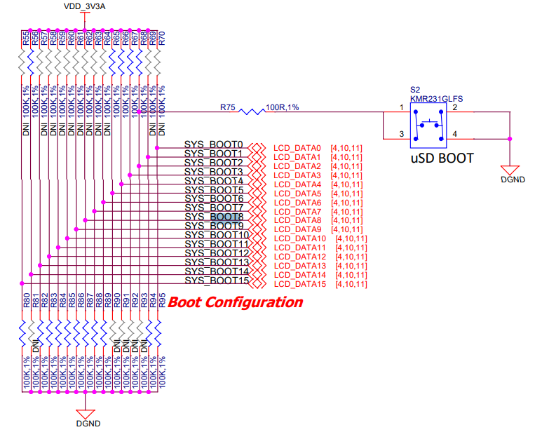

# Embedded Linux for the BeagleBone Black: DIY

This example goes through the whole development stack for an embedded Linux environment using the [BeagleBone Black board][bbb_board] (BBB).

We will walkthrough these steps:

1. Cross-toolchain creation with Crosstool-NG.
2. Bootloader compilation with U-Boot.
3. Board bring-up.
4. Linux kernel compilation.
5. Busybox compilation.
6. Sample "hello world" target application.
7. Putting everything together.

## 1. Cross-toolchain

First, install Crosstool-NG:

```bash
VERSION="1.28.0"
wget "http://crosstool-ng.org/download/crosstool-ng/crosstool-ng-${VERSION}.tar.bz2"
tar -xf "crosstool-ng-${VERSION}.tar.bz2"
cd "crosstool-ng-${VERSION}"

sudo apt update && sudo apt install -y \
    gcc g++ gperf bison flex texinfo help2man make libncurses-dev \
    python3-dev autoconf automake libtool libtool-bin gawk wget bzip2 \
    xz-utils unzip patch libstdc++6 rsync git meson ninja-build

./configure --enable-local
make
```

Provided that the BBB has a Cortex-A8, and after a quick run of `./ct-ng list-samples`, load the most similar defconfig:

```bash
./ct-ng arm-cortex_a8-linux-gnueabi
```

Configuration file can be found in `config/ct-ng_bbb_defconfig`. The most important parameters for the toolchain are the architectural ones and the C library choice:

* CPU architecture: `-mcpu=cortex-a8`.
* Hardware FPU: `-mfpu=vfpv3`.
* NEON floating point ABI: `-mfloat-abi=hard`.
* C-library: `musl`.

Load the defconfig if you need to, and compile the toolchain:

```bash
DEFCONFIG=<defconfig_file> ./ct-ng defconfig
./ct-ng build
```

## 2. Bootloader

Install U-Boot:

```bash
VERSION="v2026.01"
git clone https://github.com/u-boot/u-boot.git
git checkout ${VERSION}
```

For building U-Boot, there is no need to modify much of the default configuration file. Just import the defconfig `am335x-evm_defconfig` and use the `am335x-boneblack` device tree and build:

```bash
export CROSS_COMPILE=<cross_compilation_toolchain->
make am335x_evm_defconfig
make DEVICE_TREE=am335x-boneblack
```

It produces many binaries, we are only interested in the SPL (called `MLO` because of a Texas Instrument requirement), and the full U-Boot image `u-boot.img`. There is a third one called `spl/u-boot-spl.bin`, which is an image that combines both SPL and main U-boot.

U-Boot's defconfig can be found in `config/uboot_bbb_defconfig`.

## 3. Board bring-up

The boot order of the BeagleBone black depends on the BOOT pins. If we go to the board's [schematic][bbb_schematic], we can see that they have fixed pull-ups and pull-downs, except for the SYS_BOOT2, which is connected to the S2 button:



According to the manual, the boot order is as follows:

| S2 pressed?   | Boot 0        | Boot 1    | Boot 2    | Boot 3    |
|:-------------:|:-------------:|:---------:|:---------:|:---------:|
| No            | MMC1 (eMMC)   | MMC0 (SD) | UART0     | USB0      |
| Yes           | SPI0 (x)      | MMC0 (SD) | USB0      | UART0     |

We will now review the steps required to boot from each exposed device.

### Booting from UART

To boot from UART we need to:

1. Press the S2 button.
2. Don't have am SD connected.
3. Don't have an USB0 connected.
4. Connect an USB-to-Serial between the host's PC and the UART0 pins.
5. Connect the power supply through the 5mm Jack connector.

If everything worked correctly, you should see that the BeagleBone Black keeps printing the character "C" through the UART:

```bash
$ picocom -b 115200 /dev/ttyUSB0
CCCCCCCCCCCCCCCCCCC
```

We will use [Snagboot][snagboot] to load U-Boot through the UART.

First install it the Python package with pip, inside a virtual env.:

```bash
python3 -m pip install --user snagboot
```

Then, load the SPL and U-Boot through UART:

```bash
snagrecover -s am3358 --uart /dev/ttyUSB0 --baudrate 115200 -f bring_up/snagboot_am335x.yaml
```

After that, you should have U-boot loaded in the RAM. Connect through UART, connect the USB and let's issue the commands to copy U-Boot into the eMMC:

```bash
(uboot) mmc dev 1
(uboot) ums 0 mmc 1
```

Then, you should see the device on the computer, let's format it:

```bash
# Check the name of the block device connected
sudo dmesg | tail

# Erase partition table
sudo dd if=/dev/zero of=/dev/sda bs=1MB count=16

# Create a "dos" partition table with a 64MiB bootable fat32 partition and the remaining size an EXT4
sudo cfdisk sda

# Create filesystem
sudo mkfs.fat  -a -F 32 -n boot_emmc /dev/sda1
sudo mkfs.ext4 -L linux_emmc /dev/sda2
```

Finally, copy the `bin/MLO` and `bin/u-boot.img` files inside the FAT partition of the eMMC. After a power cycle of the board, U-Boot should boot from the eMMC as expected.

### Booting from USB

To boot from USB we need to:

1. Press the S2 button.
2. Don't have a SD connected.
3. Connect an USB-to-Serial between the host's PC and the UART0 pins.
4. Connect the USB0 for power + signal.

If everything was done correctly, you should see that the USB device was discovered in the kernel messages:

```bash
sudo dmesg | tail -n 10
[22639.124369] usb 5-1.2.3.2: New USB device found, idVendor=0451, idProduct=6141, bcdDevice= 0.00
[22639.124378] usb 5-1.2.3.2: New USB device strings: Mfr=33, Product=37, SerialNumber=0
[22639.124383] usb 5-1.2.3.2: Product: AM335x USB
[22639.124387] usb 5-1.2.3.2: Manufacturer: Texas Instruments
[22639.228744] rndis_host 5-1.2.3.2:1.0 usb0: register 'rndis_host' at usb-0000:c5:00.3-1.2.3.2, RNDIS device, 9a:1f:85:1c:3d:0e
[22639.257270] rndis_host 5-1.2.3.2:1.0 enx9a1f851c3d0e: renamed from usb0
```

Then, prepare snagrecover for USB usage:

```bash
snagrecover --am335x-setup > bring_up/am335x_usb_setup.sh
chmod a+x bring_up/am335x_usb_setup.sh
sudo bring_up/am335x_usb_setup.sh
```

If you have your UART interface opened and execute the following command, you should see the image being loaded and the U-Boot terminal showing up.

```bash
snagrecover -s am3358 -f bring_up/snagboot_am335x.yaml
```

Finally, you may reproduce the steps from the UART boot to permanently store the U-Boot image in the eMMC if you want.

### Booting from eMMC

The only requirement is to have a valid FAT32 partition in the eMMC with the `MLO` and `u-boot.img` files in it. If these conditions are met U-Boot should load from the eMMC after a power cycle without pressing the S2 button.

### Booting from SD Card

The only requirement is to have a valid FAT32 partition in the SD card with the `MLO` and `u-boot.img` files in it. If these conditions are met U-Boot should load from the SD card after a power cycle while pressing the S2 button.

## 4. Linux kernel

Clone the stable linux repo, and checkout the desired version:

```bash
VERSION="linux-6.19.y"
git clone https://git.kernel.org/pub/scm/linux/kernel/git/stable/linux.git
git checkout ${VERSION}
make kernelversion
```

Setup the architecture and cross compiler path, then load the most similar defconfig and configure as desired:

```bash
export ARCH=arm
export CROSS_COMPILE=<path_to_toolchain->
make omap2plus_defconfig
make nconfig
```

Build the kernel:

```bash
make -j$(nproc)
```

The files are generated in `arch/arm/boot/zImage` and `arch/arm/boot/dts/ti/omap/am335x-boneblack.dtb`.

## 5. Busybox

Install it:

```bash
git clone https://git.busybox.net/busybox
cd busybox/
git checkout 1_36_stable
```

Set-up default configuration and do your changes. Make sure that it's built as a static binary:

```bash
make defconfig
make menuconfig
```

Point to the cross-compiler toolchain, build it and install it:

```bash
export CROSS_COMPILE=<toolchain->
make
make install
mkdir _install/dev
tar -C _install -c -f rootfs.tar .
```

## 6. Hello world application

This step is very straightforward. We will create a simple "hello world" static binary in C, with the cross-compiler.

```bash
echo "#include <stdio.h>" > /tmp/hello_world.c
echo "int main(void) {printf(\"Hello World\\n\");}" >> /tmp/hello_world.c
TOOLCHAIN=<toolchain->
${TOOLCHAIN}gcc -o bin/hello_world
```

## 7. Putting everything together

First, plug the SD card. Erase all contents, make a FAT32 64MiB bootable partition and an EXT4 partition. Load `MLO`, `u-boot.img`, `zImage` and `am335x-boneblack.dtb` into the FAT partition and untar the `rootfs.tar` into the ext4 partition. Also, copy your application binary `hello_world` into the SD card `/usr/bin/hello_world` path:

```bash
sudo dd if=/dev/zero of=/dev/sda bs=1M count=16
sudo cfdisk /dev/sda
sudo mkfs.fat  -a -F 32 -n boot_sd /dev/sda1
sudo mkfs.ext4 -L linux_sd /dev/sda2

cp bin/MLO bin/zImage bin/u-boot.img bin/am335x-boneblack.dtb /media/${USER}/boot_sd
sudo tar -xf bin/rootfs.tar -C /media/${USER}/linux_sd/
cp bin/hello_world /media/${USER}/linux_sd/usr/bin
sudo chown -R 0:0 /media/${USER}/linux_sd/*
```

Finally, connect your USB-to-Serial, boot the kernel image and run the `hello_world` app:

```bash
picocom -b 115200 /dev/ttyUSB0
(u-boot) setenv bootcmd "fatload mmc 0:1 0x81000000 zImage; fatload mmc 0:1 0x82000000 am335x-boneblack.dtb; bootz 0x81000000 - 0x82000000"
(u-boot) setenv bootargs "console=ttyS0,115200n8 root=/dev/mmcblk0p2 rootfstype=ext4 rw rootwait"
(u-boot) saveenv
(u-boot) boot
[...] # Linux booting
$ hello_world
Hello World
```

## References

[AM335X Sitara datasheet][am335x_sitara_datasheet]
[AM335X Technical Reference Manual][am335x_trm]

<!--External links-->
[am335x_sitara_datasheet]: https://www.ti.com/document-viewer/AM3358/datasheet
[am335x_trm]: https://www.ti.com/lit/ug/spruh73p/spruh73p.pdf
[bbb_schematic]: https://github.com/beagleboard/beaglebone-black/blob/master/BBB_SCH.pdf
[bbb_board]: https://www.beagleboard.org/boards/beaglebone-black
[snagboot]: https://snagboot.readthedocs.io/en/latest/users/
